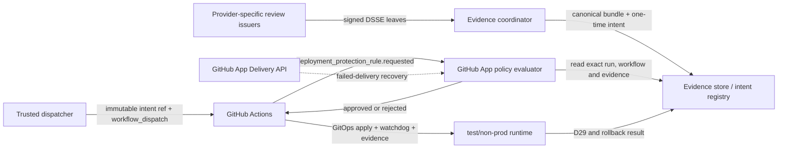
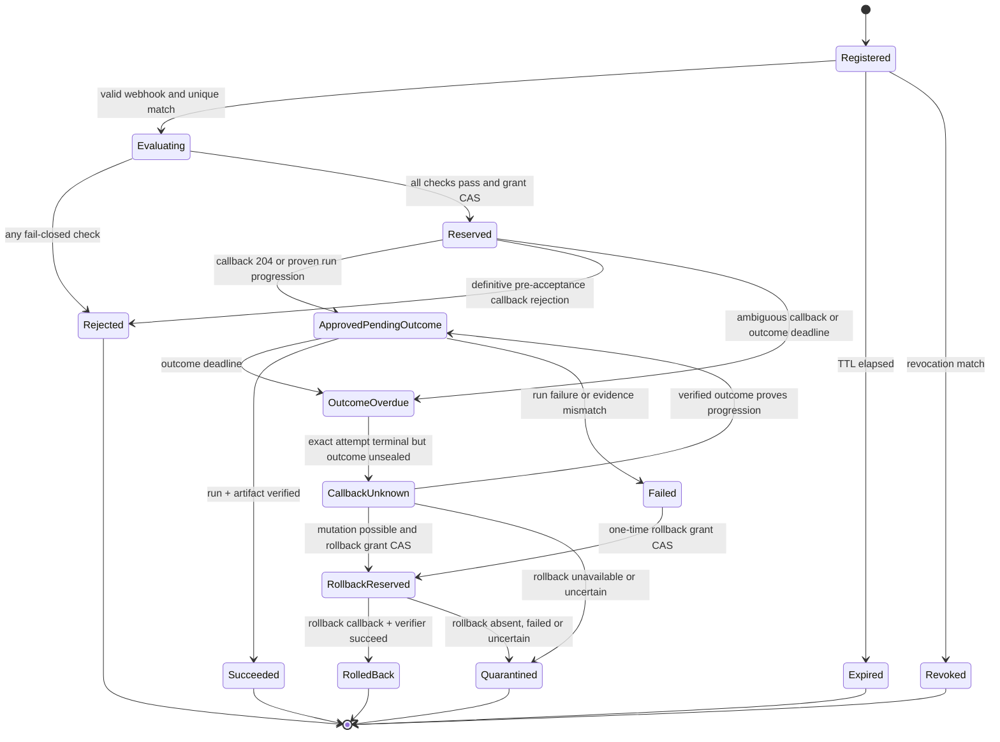

# ADR-0045 — Signed Cross-AI Evidence Custom Deployment Protection Rule

> **Forward-policy status (2026-07-19, #2688): CODEX-ONLY.**
> Bu v1 üç-sağlayıcı tasarımının şema ve fixture'ları yalnız arşiv/forensic kayıt
> açıklaması için korunur; cutoff sonrası aktif verifier MiniMax taşıyan trust
> root veya bundle'ı doğrulamaz. #2638'in optional-Claude kararı da superseded'dır
> ve yeni review, trust root, deployment grant veya activation yetkisi üretmez.
> Aktif v2 yalnız ayrı read-only/ephemeral bağlamda exact `gpt-5.6-sol xhigh`
> direct OpenAI Codex review leaf'i kabul eder; Claude, MiniMax, Cursor, UI,
> wrapper ve fallback leaf'leri schema/trust-root seviyesinde reddedilir.

> **Status:** PROPOSED — source implementation, fail-closed tests, GitHub App
> registration, the Phase-1 receive-only test observer, outbound failed-delivery
> recovery and test-Vault App private-key provisioning exist. The owner-gated
> TEST Transit bootstrap, retired-provider decommission contract and three protected
> workflow lanes are source-ready but have not been activated. Direct
> OpenAI adapter activation, dispatcher App, Environment
> configuration and live enforcement do not exist yet.
> **Date:** 2026-07-16
> **Owner issue:** [#2502](https://github.com/Halildeu/platform-k8s-gitops/issues/2502)
> **Customer slice:** [#2373](https://github.com/Halildeu/platform-k8s-gitops/issues/2373)
> **Governance prerequisite:** [#2504](https://github.com/Halildeu/platform-k8s-gitops/issues/2504)
> **Scope:** reversible test/non-prod deployment authorization. Production and
> named-human gates remain outside autonomous approval.

## 1. Context

Faz 22.6 VIEW_ONLY product acceptance uses two protected GitHub Actions paths:

1. `.github/workflows/apply-view-only-viewer-pilot-enable.yml` activates a
   bounded test-only viewer surface and installs an absolute-expiry watchdog.
2. `.github/workflows/faz22-6-view-only-viewer-browser-evidence.yml` runs the
   attended browser/render evidence collector against that activation.

Both target `faz22-view-only-pilot`. Today they can require separate GitHub
Environment approvals even when the exact commit/digest, multi-provider
engineering review, TTL, watchdog and compensating rollback contract have not
changed. This repeated click is an engineering gate, not the product user's
attended consent.

The customer journey remains:

> An authorized browser operator starts a VIEW_ONLY session for an approved
> pilot endpoint; the endpoint user gives attended consent; real frames are
> delivered and rendered through the product channel; the next verifier can
> consume a content-addressed result.

This ADR may remove repeated **machine-delegable** GitHub approval from that
journey. It may not replace:

- endpoint attended consent or consent withdrawal;
- a named Legal/DPO/company-authority signature when policy requires one;
- production secret-owner approval;
- an irreversible production mutation;
- a GitHub required-reviewer decision attributed to a human account.

Cross-AI agreement is deployment input, not deployment truth. CI, security
checks, ADR-0023 desired-state authority, D29 post-deploy proof, watchdog and
rollback remain independent gates.

### 1.1 Current evidence is not sufficient for machine approval

The current VIEW_ONLY authorization builder binds an owner directive, an
AI-advisory comment, an Environment configuration snapshot, an exact run and
an exact head SHA. This is useful evidence, but the verifier deliberately
requires:

```text
aiAdvisoryProvenanceClass = owner-attested-provider-session
aiProviderCryptographicAttestation = false
```

Therefore the existing receipt is **not** a cryptographically signed
provider-evidence chain and MUST NOT be treated as input that can replace the
required-reviewer gate. ADR-0045 introduces a new evidence class; it does not
silently reinterpret the old receipt.

## 2. GitHub platform facts and constraints

The design is based on the GitHub documentation snapshot
`github/docs@b15cafc1cefdd69ec59d4faf19c1ba558b4f36fc` and the current GitHub
REST OpenAPI description checked on 2026-07-16.

| Constraint | Design consequence |
|---|---|
| A custom deployment protection rule is a GitHub App receiving `deployment_protection_rule` / `requested`. | The enforcement identity is a separate App, never a human account. |
| GitHub documents Actions read and Deployments read/write for the rule; this design also needs Contents read to independently hash the workflow and local dependencies at the exact SHA. | The App gets no Contents write, Actions write, Secrets, Administration or cluster credential. |
| The webhook includes environment, SHA, ref, repository, installation and `deployment_callback_url`. | These values seed evaluation but are re-fetched and cross-checked; none is trusted alone. |
| GitHub's App-authenticated REST API exposes App webhook delivery list/detail records, but `request.payload` is parsed JSON rather than the original signed body. | A bounded outbound reconciler may recover failed inbound deliveries. It records `github_app_delivery_api_v1` provenance and never claims raw-body HMAC verification. |
| Decision API is `POST /repos/{owner}/{repo}/actions/runs/{run_id}/deployment_protection_rule`. | Request body uses exact `environment_name` and `state=approved|rejected`; the App can only review its own rule. |
| The App cannot approve a human/team required-reviewer rule. | Machine-only non-prod environments must explicitly replace the repeated reviewer rule; human-required environments retain it. |
| Jobs cannot read Environment secrets until every enabled protection rule passes. | Existing Environment secret scope remains narrow; the App never reads those secrets. |
| GitHub waits up to 30 days for a custom rule response. | Platform timeout is not the security policy: this App rejects or expires in minutes. |
| Up to 10 status reports, each at most 1024 characters, can be posted before a decision. | The App uses at most three bounded, redacted status messages. |
| At most six deployment protection rules can be enabled per Environment. | ADR-0045 consumes one slot and must be included in Environment capacity review. |
| The feature is public preview. It is available for public repositories on all plans; private/internal use requires GitHub Enterprise. | Rollout is feature-flagged and has a required-reviewer rollback path. This repository is currently public. |
| Custom App rules require a deployment object and are incompatible with `environment.deployment=false` where that option is available. | Governed jobs retain normal Environment deployment creation. |

## 3. Decision

Build a separate-service-identity GitHub App named provisionally
`cross-ai-deployment-policy`. The App verifies a pre-registered, signed,
content-addressed Cross-AI deployment intent and approves only allowlisted,
reversible test/non-prod workflow stages.

The App is a **policy enforcement point**, not an AI reviewer, workflow
dispatcher, secret broker or deployment runner.

### 3.1 Component boundary



Responsibilities:

| Component | May do | Must not do |
|---|---|---|
| Provider review issuer | Invoke one real provider route, capture provider-reported identity or an explicitly weaker trusted-launch receipt, canonicalize and sign its own review leaf | Sign for another provider family; upgrade a requested/launch-only slug to provider-reported identity; contain deployment credentials |
| Evidence coordinator | Verify leaves, close the REVISE chain, create bundle/root digest and one-time intent | Manufacture a missing reviewer signature; decide GitHub protection alone |
| Intent registry | Enforce nonce, TTL, sequence, CAS reservation/consumption and revocation | Store raw secrets, screen content or unrestricted prompts |
| GitHub App evaluator | Validate HMAC webhook or App-authenticated failed-delivery record, re-fetch GitHub truth, verify bundle/policy, approve/reject its own rule | Treat parsed REST payload as HMAC evidence, dispatch workflows, write repository contents, read Environment secrets, access Kubernetes |
| Trusted dispatcher | Create the immutable intent ref, register intent, dispatch exact allowlisted workflow/stage | Approve a rule, edit evidence after registration |
| Deployment workflow | Apply desired state, verify runtime, rollback on failure | Treat App approval as D29/product acceptance |

### 3.2 Provider identity and independence

Every review leaf records two independent dimensions:

- `channel`: `direct-anthropic-cli`, `direct-minimax-cli` or `openai-codex`;
- `providerFamily`: for example `anthropic`, `xai`, `minimax`, or `openai`.

Quorum counts distinct `providerFamily` values, not wrapper/channel names.
Cursor-routed Claude remains `providerFamily=anthropic` and does not form a
provider-distinct pair with direct Anthropic Claude. `directProviderCli` is
recorded explicitly. The requested model slug is not authoritative; the
issuer records live capability discovery and a mandatory `modelIdentityClass`.
`provider-reported` requires a result field such as direct Claude
`modelUsage`; `trusted-launch-attested` means the isolated issuer live-listed
and launched the exact route but the wrapper did not report backend model
identity. The latter is never promoted to direct provider evidence. Cursor's
2026-07-17 JSON result has this weaker class; it exposes a request ID but no
backend-model field.

Leaf attribution is not self-authoritative. For every counted leaf the
verifier requires:

- `leaf.providerFamily == trustRoot.keys[keyId].providerFamily`;
- `leaf.channel` is in `trustRoot.keys[keyId].allowedChannels`;
- `leaf.directProviderCli` equals the channel class fixed by that trust-root
  entry;
- `leaf.modelIdentityClass` is in the identity classes fixed by that trust-root
  entry.

Quorum is counted only from the trust-root key mapping. The same key presented
with two family labels still counts once and attribution mismatch rejects with
`PROVIDER_ATTRIBUTION_MISMATCH`.

The protected VIEW_ONLY lane uses one exact, fail-closed provider set:

```yaml
requiredProviderFamilies: [anthropic, minimax, openai]
minimumProviderFamilies: 3
maximumReviewsPerProviderFamilyCounted: 1
minimumDirectProviderRoutes: 3
requiredFinalVerdict: AGREE
openMustFixFindings: 0
```

The trust root also pins the exact model IDs `claude-opus-4-8`,
`minimax/MiniMax-M3` and `gpt-5.6-sol`. A missing provider, alias, wrapper,
unselected alternate chain, non-AGREE chain tip or unknown fourth provider is
a rejection. Provider outage or model retirement becomes `tracked_pending`;
there is no degraded 2-of-3 fallback.

A signature attests that the allowlisted issuer observed and recorded a
provider exchange. It is not falsely described as a vendor-signed model
answer unless the provider itself later exposes a verifiable response
signature.

### 3.3 Signature and content-addressing contract

Review leaves and the final bundle use DSSE envelopes over RFC 8785 JSON
Canonicalization Scheme bytes. Digests are `sha256:<64 lowercase hex>`.

Initial trust model:

- each provider issuer has a separate Vault Transit Ed25519 key and workload
  identity;
- the coordinator has a distinct bundle-signing key;
- private keys never leave Vault Transit and never enter workflow arguments,
  logs, Actions artifacts or the GitHub App container;
- DSSE payload types are fixed separately to
  `application/vnd.acik.cross-ai-deployment-review.v1+json` and
  `application/vnd.acik.cross-ai-deployment-bundle.v1+json`; key IDs use
  the versioned `vault-transit://<mount>/<key>#v<version>` form;
- public keys, key IDs, provider-family mapping, validity window and revocation
  state are versioned in a dual-control signed trust-root manifest;
- the App pins the trust-root manifest digest in deployment configuration.
  Issuer keys cannot sign that manifest, and a trust-root change cannot
  authorize the deployment that activates the same change. It uses a separate
  PR and named-human management approval, with two-root overlap during rotation
  capped at 72 h by the manifest schema;
- revocation manifests are signed by a key distinct from all issuer and
  coordinator keys, have a bounded `nextUpdate`, and are re-read and verified
  fail-closed for every decision so a mounted update requires no restart;
- the App verifies every counted provider leaf and the coordinator envelope;
  the coordinator signature alone is never quorum;
- signer rotation has an overlap window; compromise causes immediate key and
  bundle revocation plus rejection of every unconsumed intent that used the
  key, regardless of the leaf's nominal issuance time. For historical
  validation, a leaf issued at or after `effectiveAt - maxClockSkew` is also
  invalid.

Sigstore keyless identities may replace Vault Transit in a later ADR only if
offline identity constraints, transparency-log availability and outage
semantics are defined. They are not silently mixed into v1.

The v1 verifier accepts only the DSSE/Vault-Transit profile above. A keyless or
mixed trust-root envelope is a schema/policy rejection, not a configuration
fallback.

The initial trust-root manifest is not self-authorizing. The TEST Vault owner
first verifies the bootstrap receipt's cluster ID, six versioned public keys
and receipt digest out of band. A later trust-root release copies those public
keys, binds the Anthropic, MiniMax and OpenAI keys to their exact live provider
family/channel/model IDs, and pins the
manifest digest in a separate reviewed deployment change. No Transit key signs
or approves the trust-root manifest that first authorizes that same key.

If fewer than all three exact provider routes are live, no weaker quorum mode
is entered: the schema, trust root and verifier continue to require Anthropic,
MiniMax and OpenAI as three distinct direct provider families. Capability
unavailability therefore blocks authorization rather than changing the meaning
of Cross-AI quorum.

### 3.4 Canonical evidence bundle

The normative v1 object is the strict
`schema/cross-ai-deployment-bundle-v1.schema.json` contract with
`schemaVersion=acik.cross-ai-deployment-bundle.v1` and
`additionalProperties: false` at every object boundary. It requires the exact
subject, three signed workflow stages, one signed runner-admission lease,
content-addressed provider review envelopes, closure, exact three-provider
consensus and the bounded grant. The executable example is generated by
`tests/github_apps/cross_ai_policy_fixtures.py`; CI validates that exact fixture
against the schema and the production verifier. This ADR intentionally does
not duplicate a hand-maintained JSON specimen that could drift from the
machine-enforced contract.

The three canonical stage paths in that fixture and the signed policy are the
dedicated no-input protected workflows:

- `.github/workflows/apply-view-only-viewer-pilot-protected.yml`;
- `.github/workflows/faz22-6-view-only-viewer-browser-evidence-protected.yml`;
- `.github/workflows/rollback-view-only-viewer-pilot-protected.yml`.

Raw prompts and full transcripts are not part of the deployment bundle.
Privacy-minimized leaves contain digests, bounded findings, verdict and
attribution. If a raw transcript must be retained for a dispute, it is
encrypted separately with shorter retention and never returned in the GitHub
status comment.

`sessionSha256` is not an informal label. It is:

`SHA-256(JCS({domain, requestId, deploymentSessionId, repositoryId,
environment, headSha, intentRef, endpointIdSha256, operatorIdSha256}))`,

where `domain=acik.cross-ai-deployment-session.v1`. The coordinator generates
`requestId`, a cryptographically random `deploymentSessionId` and independent
256-bit stage nonces from the operating-system CSPRNG before review. Raw nonces
are never logged or placed in GitHub-visible fields; the bundle carries only
their digests. The hash excludes itself, so there is no circular digest. Every
review leaf, workflow stage, outcome record and grant binds this same session
hash.

`artifactSetSha256` is the JCS digest of a strict CAS manifest, not a directory
glob. Each entry has `logicalPath`, `role`, `mediaType`, `gitObjectId` where
applicable, byte length and SHA-256. Entries cover the rendered desired-state
manifest, complete Kustomize source tree, immutable image/runtime-artifact
digests and policy inputs used by the reviewed mutation. They are sorted by
UTF-8 byte order of `(role, logicalPath)`; duplicate paths, symlinks, missing
roles and unstated files reject. Independent builders must reproduce the same
root.

### 3.5 Multi-round REVISE closure

A single `AGREE` string is insufficient. The bundle verifier requires:

1. each review leaf has a valid allowlisted issuer signature;
2. each leaf binds its reviewed subject digest and exact artifact/plan inputs;
3. verdict is one strict enum value: `AGREE`, `REVISE`, `RED` or
   `PARTIAL`; free text never becomes policy state;
4. `REVISE` and `RED` raise at least one stable finding ID, while `PARTIAL`
   carries at least one real raise/resolve/acknowledge transition; a state-free
   non-`AGREE` verdict is invalid and cannot disappear beneath a later
   `AGREE`;
5. every prior `REVISE`, `RED` or `PARTIAL` must-fix finding has a stable
   finding ID, signed response/fix leaf and later acknowledgement by the
   provider family that raised it;
6. a finding ID identifies exactly one raise event in the whole bundle; it
   cannot be re-opened after acknowledgement or raised and acknowledged in the
   same review, a resolve/acknowledgement cannot reference a finding that was
   never raised, and an `AGREE` leaf carries no finding-state transition;
7. finding, fix and acknowledgement leaves form an ordered hash chain whose
   `closureRootSha256` is identical in the consensus object and every counted
   final `AGREE` leaf;
8. the final exact subject has exactly three counted `AGREE` leaves, one from
   each required direct provider family: Anthropic, MiniMax and OpenAI;
9. no unexpired revocation entry matches a leaf, bundle, key, subject or
   grant;
10. the final bundle and all counted leaves are fresh at decision time.

`subjectSha256` is normatively the JCS digest of the full authorization
subject, ordered workflow stages and material grant constraints. The
coordinator cannot reuse valid leaves with another stage list, actor, nonce,
TTL or closure graph.

If the commit, workflow blob, artifact set, policy, rollback plan or
post-deploy verifier changes, the subject digest changes and the old agreement
cannot authorize the new subject.

Every direct provider-review key is restricted to the `provider-reported`
model identity class in addition to one exact model ID and one direct channel;
trusted-launch attribution cannot satisfy a direct-provider lane.

## 4. Correlating a GitHub run to a signed intent

The protection webhook does not provide an application-defined deployment
intent ID. Trusting only `(repository, environment, head SHA)` would permit a
confused-deputy/replay race. The 2026-07-16 GitHub REST OpenAPI
`workflow-run` schema and a live `workflow_dispatch` run were both checked:
the run response does **not** expose workflow inputs. Consequently neither a
hidden input nor `display_title` is an authorization primitive.

ADR-0045 uses a pre-registration plus an immutable, one-time Git ref. The
official webhook/run fields remain the GitHub-side authority; the ref provides
the missing application correlation.

### 4.1 Registration

Before review, the coordinator creates a UUIDv7 `requestId`, a random
`deploymentSessionId`, independent 256-bit stage nonces and the deterministic
ref name `refs/tags/cross-ai-intent/<requestId>`. After provider consensus, a
dedicated trusted dispatcher:

1. authenticates to `/v1/deployment-intents` with an allowlisted mTLS/SPIFFE
   workload identity; generic repository workflow OIDC is not accepted in v1;
2. registers exactly
   `(requestId, bundleSha256, subjectSha256, grantSha256, intentRef)`;
3. creates the lightweight intent tag at the exact reviewed `headSha` using a
   separate dispatcher GitHub App identity;
4. verifies the tag object/ref from GitHub and finalizes the registry record;
5. dispatches the allowlisted workflow with
   `ref=cross-ai-intent/<requestId>`.

`workflow_dispatch` has no GitHub idempotency key. The dispatcher therefore
uses a durable at-most-once outbox rather than an unsafe automatic retry. It
commits `Pending -> Sending` with `synchronous=FULL` before the external POST.
Only an empty HTTP 204 becomes `Accepted`. Transport failure, 408, 409, 422,
425, 429, 5xx or a non-empty 204 becomes `Uncertain`; every other response is
`Rejected`. `Sending`, `Uncertain` and `Rejected` are never posted again. A
crash before the POST may sacrifice liveness but cannot create a duplicate
deployment.

An ambiguous job becomes `Accepted` only when GitHub returns exactly one live
workflow run matching the signed repository ID/name, immutable intent tag,
head SHA, workflow path, numeric triggering actor and bounded creation window.
Zero matches remain unresolved; multiple matches reject as ambiguous. The
live intent ref is re-read before reconciliation. Every later stage also
re-verifies the DSSE bundle against the current trust-root pin, revocations and
policy, so a durable registry row cannot outlive a revocation decision.

Repository tag rules restrict create/update/delete for
`cross-ai-intent/**` to the dispatcher identity. An intent ref is never moved.
Deletion is a retention task after the grant and audit window, never a retry
mechanism. The evaluator re-fetches the ref and rejects if it is absent, moved
or resolves through an unexpected object chain.

The dispatcher App is a dedicated, single-repository installation. Although
GitHub grants its required `contents: write` at repository scope, repository
rulesets deny it branch writes and tag create/update outside
`refs/tags/cross-ai-intent/**`; within that namespace it may create and later
delete but never update/force-move. Its egress layer implements only create-ref,
get-ref and retention delete-ref. Every other Contents write is blocked and
alerted. Phase 1 cannot exit if these negative controls are not proven live.

The registry accepts only the dispatcher numeric GitHub App/actor identity
mapped to its mTLS principal. GitHub Actions OIDC is not accepted for intent
registration or dispatch authority. It is used only as the post-approval runner
bootstrap second factor described below; “any workflow in this repository” is
forbidden in both paths.

The intent registry allows only one active intent for the same repository,
Environment, head, intent ref, workflow stage and session. Ambiguity rejects
closed.

### 4.2 GitHub run binding

The App extracts the run ID only after validating the callback URL shape, then
fetches GitHub truth with its installation token. It verifies all of:

- repository numeric ID and installation ID;
- event is exactly `workflow_dispatch`; `push`, `workflow_run`,
  `pull_request` and every other event reject;
- exact head SHA and exact immutable intent tag/ref;
- exact workflow ID/path and workflow blob digest at that head;
- numeric triggering actor ID equals the registered dispatcher actor ID;
- run creation is after registration and within the bounded dispatch window;
- run ID and run attempt have not consumed the grant;
- Environment and stage match the bundle.

The run `display_title` may include the request ID for operator diagnostics,
but it is never parsed for authorization. `triggeringActorLogin` is also
diagnostic; the stable numeric actor ID is authoritative.

The App uses Contents read to fetch the workflow and all same-repository local
actions/reusable workflows at `headSha`. Every external `uses:` reference must
be a full commit SHA. A signed dependency lock lists local Git object IDs and
external `repository@commit` pairs; mutable tags/branches are a rejection.

Runner selection is also part of the subject. A management reconciler key,
distinct from issuer/coordinator keys, signs the exact `runs-on` labels,
numeric runner-group ID, workflow access restrictions and inventory digest.
`runnerInventoryMaxAge` is 60 s. For a self-hosted group, every currently
eligible runner must satisfy the declared attestation class; one unknown/stale
member rejects the stage.

Before approval, the App also acquires a signed admission lease whose digest is
`runnerAdmissionLeaseSha256`. The bundle also carries the corresponding DSSE
envelope, signed by a fifth, role-distinct `runner-management` Transit key. It
freezes additions and label/group changes for the grant window and binds the
eligible runner IDs/inventory generation. The evaluator re-fetches the complete
repo-scoped runner inventory through GitHub before approval; the bootstrap path
then re-fetches the assigned job and requires its numeric `runner_id` and hashed
runner name to occur exactly once in that lease. For the current personal-account
repository, this exact repo inventory is authoritative; an organization runner
group is not invented where GitHub does not provide one.
Security quarantine/removal remains allowed but immediately revokes the lease
and intent. A changed generation before assignment blocks execution. This
check occurs before Environment approval because a later workflow step cannot
protect secrets from an already-selected untrusted runner.

Because GitHub does not expose dispatch inputs at this gate, v1 allowlisted
machine-gated workflows declare **no `workflow_dispatch` inputs**. Stage comes
from the allowlisted workflow path; TTL/watchdog comes from the signed grant;
target/operator comes from the signed subject; prior apply run and artifact
come only from the immutable outcome record. A CI policy rejects any governed
workflow that reads `inputs.*`, authorization-relevant `vars.*`, mutable
control-plane environment values or an unpinned remote control document. Static
constants and Environment secret values are usable only where the pinned
bootstrap compares their digests to the signed subject before side effects.

The v1 execution profile contains exactly one governed job. One full-SHA
`actions/checkout` step is followed immediately by the single-line bootstrap
command with a fixed argument set. Every later step is a full-commit-SHA or
image-digest `uses:` action; arbitrary/local `run:` steps, local actions,
additional jobs, shell overrides, unbounded `with:` controls and a second
checkout are rejected. Each execution action receives only the verified
`$RUNNER_TEMP/cross-ai-bootstrap.json` path. This prevents multiline or
alternate-tool download-and-execute bypasses while keeping the executable
dependency set content-addressed in the signed lock.

The current `action`, `pilot_ttl_minutes`, `device_id`, `hostname` and
`activation_run_id` surfaces are therefore not accepted in the machine-gated
lane. Apply and compensating rollback become distinct workflow paths. After
App approval, the first pinned bootstrap step fetches the bundle/outcome by
`requestId` parsed from `github.ref`, recomputes every digest, and requires the
Environment endpoint/operator secret digests to equal the signed opaque
bindings before any other secret use or side effect. Phase 2 cannot start until
that refactor and its negative tests land.

The source implementation uses a one-time `POST /v1/runner-bootstrap` exchange.
The high-entropy Environment credential is never an argv/input value; only its
SHA-256 is part of the reviewed subject and session binding. It is necessary but
not sufficient; source and client reject values shorter than 64 ASCII
characters. The governed workflow must grant `id-token: write` and present a
fresh GitHub Actions OIDC token with the fixed
`acik-cross-ai-runner-bootstrap` audience. The service verifies GitHub's RS256
signature and exact issuer, repository numeric ID/name, Environment, immutable
ref, head SHA, workflow path/ref, `workflow_dispatch`, self-hosted runner class,
run/attempt, numeric triggering actor, `sub`, `jti` and bounded token lifetime.
Neither the OIDC token nor the Environment credential is accepted alone.
The bootstrap endpoint is exact HTTPS on the standard port; loopback HTTP is
not a production or test exception. GitHub's JWKS is cached for a bounded
interval, with at most one rate-limited forced refresh on an unknown `kid`, and
the RSA profile is pinned to RS256 with public exponent 65537.
The full endpoint is the required `runnerBootstrapUrl` inside the signed policy
digest. Both static workflow inspection and the runtime client require exact
equality, so an otherwise valid attacker HTTPS host cannot receive the OIDC or
subject-bound credential.

A bootstrap request is accepted only for the exact finalized request, stage,
run/attempt, workflow, immutable ref, head and live in-progress job runner. The
App re-verifies the current revocation set, trust-root pin, policy, signed runner
lease, live runner inventory and ref at serve time. SQLite then atomically
records the canonical response digest; a second fetch rejects rather than
replaying the bundle. Approval-to-bootstrap is bounded to two minutes. The
client independently verifies the DSSE bundle, policy/trust-root pins, response
digest, prior outcome and protected endpoint/operator digests before any
mutation step.

This is source-ready only. Enforcement remains disabled until the owner-gated
six-key TEST Transit bootstrap, public trust-root release, HTTPS Vault/runtime
path, separate dispatcher App identity, repository Administration-read permission
for runner inventory, protected no-input workflows and a live negative/rollback
canary are all proven. Attended endpoint consent remains a runtime human receipt;
the bootstrap response never asserts it.

The App never follows an arbitrary `deployment_callback_url`. On github.com it
requires the exact `https://api.github.com/repos/<owner>/<repo>/actions/runs/<id>/deployment_protection_rule`
shape and reconstructs the REST route from validated repository/run values.
This prevents SSRF and cross-repository callback confusion.

### 4.3 Ordered #2373 grant and failure transition

One signed intent may authorize exactly this primary sequence plus one failure
transition:

1. `apply`: one callback/run/attempt; bounded TTL; watchdog and rollback plan
   digests fixed.
2. `browser-evidence`: one callback/run/attempt; same head/session; only after
   the App has observed the apply run succeed and produced an immutable
   prior-stage outcome record.
3. `compensating-rollback`: not a normal successor; one callback/run/attempt
   only from `Failed` or `CallbackUnknown`, using the original signed rollback
   plan, a dedicated no-input workflow path and its own stage nonce.

The authority is an Actions API reconciliation keyed by the already-bound
`run_id/run_attempt`. The Phase-0 source uses a durable 30 s sweeper so missed
webhooks and restarts do not strand terminal outcomes. A later live slice may
add `workflow_run/completed` only as an immediate wake-up hint; it never
replaces polling or becomes outcome authority. Reconciliation uses the
attempt-specific run and jobs endpoints and requires:

- the exact attempt is `completed` with a recognized terminal conclusion;
- a successful run has every critical job and step conclusion `success`;
- the pinned workflow contains no `continue-on-error` on those critical
  jobs/steps;
- exact artifact name
  `cross-ai-stage-outcome-<requestId>-<stage>-<run_id>-<run_attempt>`;
- the downloaded ZIP has exactly one safe canonical
  `cross-ai-stage-evidence.json` entry; its digest and receipt fields match the
  subject, session, TTL/watchdog and workflow policy.

GitHub artifact metadata alone is not the digest authority; bytes are
downloaded and hashed. The resulting outcome record binds apply
`run_id/run_attempt`, artifact name/digest, critical-jobs digest, watchdog
absolute expiry, head, intent ref and session. It is stored in immutable CAS
and hash-chained into the registry before stage 2 can reserve a grant.

An apply failure that occurs before the watchdog is created carries a null
watchdog expiry and may seal only as `Failed`; it can never become a successful
apply or unlock browser evidence. Once a watchdog receipt exists, even failure
evidence must carry its bounded expiry. This keeps the pre-mutation failure
path terminal without inventing a watchdog receipt that never existed.

The stage-2 decision requires this outcome digest plus the original opaque
endpoint/operator digests. Attended consent is a separate session-local
runtime receipt governed by `attendedConsentPolicySha256`; App approval never
asserts that consent occurred.

The rollback workflow is protected by the same Environment and App rule. It
does not require a new AI quorum because the exact rollback plan/workflow was
part of the original reviewed bundle, but the App requires the failed-intent
binding, watchdog state and one-time rollback grant. No other workflow may
mutate this pilot outside ADR-0045 except the already-armed in-workflow
watchdog, whose identity and plan digest are also in the subject.

Apply and browser stages verify that the watchdog Job is still active, has no
failed or succeeded terminal count, and carries the exact signed bundle and
grant-expiry annotations. Compensating rollback keeps that Job as its retry
ownership marker until the rollback surface, rollouts and every other watchdog
resource have been removed and re-verified; the Job is deleted last.

The browser stage never installs executable dependencies from the network. Its
signed workflow-stage entry carries `runtimeBundleSha256`; the runner exposes
one fixed, pre-provisioned Playwright/Chromium tar archive. The stage opens the
archive without following symlinks, verifies the complete archive digest,
rejects links/devices/path traversal and only then extracts it into the private
runner temp directory. The runtime archive is therefore part of the reviewed
subject, not ambient runner state or a mutable package-registry response.

An uncertain or failed apply quarantines the intent; stage 2 is rejected until
the apply outcome is sealed. Callback ambiguity or outcome-deadline expiry
moves the stage to `OutcomeOverdue`, which does **not** unlock rollback. Only
attempt-specific GitHub truth proving the exact apply attempt terminal moves
it to `CallbackUnknown`; the signed one-time compensating rollback grant may
then reserve. A completion webhook alone, top-level `success`, or an
input-supplied activation run ID is insufficient.

Reruns do not inherit approval. A different `run_id` or `run_attempt` requires
a new one-time grant. V1 does not reuse old final-AGREE leaves for a reissue.
Reissue is allowed only from terminal `RolledBack` or a signed, CAS-addressed
`Drained` verifier outcome; it sets `reissueOf`, creates a new session/nonces,
and obtains final AGREE on the new exact subject. An absence probe or uncertain
rollback is never sufficient.

`Drained` is a strict outcome schema signed by the pinned post-deploy verifier.
It binds the prior session/head/target, proves desired and live state equal the
content-addressed pre-pilot baseline, proves pilot exposure/resources absent,
records the watchdog terminal receipt, and shows no active mutation run or
unconsumed stage grant for the session. The App re-fetches GitHub run truth and
verifies every referenced byte before accepting it.

## 5. Evaluation algorithm

The App acknowledges a valid inbound webhook quickly and enqueues evaluation.
Where GitHub cannot reach the test edge, a fail-closed outbound reconciler may
instead read failed App deliveries. Both routes converge only after their
distinct authentication provenance is recorded. The deterministic decision
order is:

1. Authenticate exactly one delivery channel:
   - inbound: verify `X-Hub-Signature-256` over the unmodified request body
     using constant-time comparison; or
   - outbound recovery: mint one App JWT per bounded poll cycle with
     `exp - iat <= 300 s`, follow no redirects, page at most five 100-item
     pages, require a fresh failed `deployment_protection_rule/requested`
     list item, fetch its detail, and require exact list/detail GUID, IDs,
     timestamp, status, event/action and configured target-URL equality.
   The REST `request.payload` is parsed JSON and is never described as HMAC
   verified. Both routes require a unique delivery GUID and compute one
   canonical semantic payload digest for collision detection.
2. Validate repository, installation, Environment, immutable intent ref and
   callback URL allowlists. Re-fetch the Environment/rule configuration and
   compare it with the signed phase policy snapshot; drift rejects.
3. Re-fetch repository/run/workflow metadata using an installation token
   scoped to this repository with Actions read, Contents read and Deployments
   read/write.
4. Parse `requestId` only from the exact intent ref, then locate exactly one
   finalized active registry record. `display_title` is ignored for policy.
5. Recompute workflow blob, transitive dependency lock, runner policy,
   management-signed runner inventory/admission-lease, policy, evidence bundle
   and subject digests. Require the lease signer, digest, eligible generation,
   60 s inventory age and unrevoked/unexpired state to match. Statically reject
   any governed workflow input declaration, authorization-relevant `vars.*`,
   mutable control-plane environment read or unpinned remote control document.
6. Verify strict schema, DSSE signatures, key policy, provider-family quorum,
   multi-round closure, freshness and revocation.
7. Verify deployment class, explicit stage order/dependencies, nonce/max-use,
   numeric actor/registration principal and expected concurrency group.
   Activate/reserve the already subject-bound runner admission lease. Where a
   concurrency group is declared, require no other live mutating run and
   acquire a registry group lease in the same transaction as the grant
   reservation.
8. For an apply stage, verify bounded TTL, watchdog headroom, rollback plan and
   post-deploy verifier are mandatory and content-addressed. For stage 2,
   verify the immutable apply outcome and target/session bindings.
9. For an approval candidate, atomically reserve the stage grant for the exact
   `(run_id, run_attempt)` plus any concurrency-group lease; reservation is not
   approval and not consumption. Re-fetch run/group state, runner admission
   lease revocation/generation and TTL/watchdog headroom immediately before
   callback.
10. POST the single chosen decision for the exact Environment using a
    repository installation access token, never the App JWT. The callback
    origin/path is reconstructed under the exact allowlisted GitHub API origin,
    redirects are disabled, and the documented success response is HTTP 204
    with no body. Record status, bounded response headers, delivery/run IDs and
    request digest in the append-only ledger.
11. Only a successful 204 or later GitHub run progression proving acceptance
    moves `reserved -> consumed/ApprovedPendingOutcome`.
12. The admitted job's first side-effect-capable step obtains a fresh GitHub
    Actions OIDC token for the fixed bootstrap audience and combines it with
    the subject-bound Environment credential. Re-verify the exact run/attempt,
    actor, ref/SHA, workflow, assigned runner, current trust/revocations/policy
    and signed runner lease before atomically consuming the bootstrap once.
13. Outbound recovery advances its durable `(delivered_at, delivery_id)`
    high-water only after the ledger proves callback status `Succeeded` in the
    same locked check. It rescans a five-minute overlap after restart, polls no
    faster than 30 seconds with bounded jitter, backs off exponentially to five
    minutes on error/rate-limit and makes readiness fail on a stale/error cycle.

No parse, network, storage, provider, signature or policy error becomes an
approval. Unknown fields, multiple candidate intents, clock ambiguity beyond
the configured skew, missing artifacts, unavailable revocation state or stale
keys all reject closed.

An ambiguous network timeout after an approval POST never causes a
contradictory rejection POST. The same idempotency record enters
`OutcomeOverdue`; the primary successor remains blocked and no audit record
claims approval. While the exact attempt is queued or executing, rollback is
also blocked to prevent concurrent writers. Once the attempt-specific API
proves a terminal conclusion, the state becomes `CallbackUnknown`; only the
pre-signed compensating rollback lane may then reserve if no verified terminal
outcome can be sealed.

### 5.1 Decision reason codes

GitHub comments are redacted and stable. Examples:

```text
APPROVED evidence=sha256:ab12... policy=v1 stage=apply ttl=90m
REJECTED code=EVIDENCE_STALE evidence=sha256:ab12...
REJECTED code=PROVIDER_FAMILY_QUORUM_MISSING
REJECTED code=PROVIDER_ATTRIBUTION_MISMATCH
REJECTED code=HEAD_OR_WORKFLOW_MISMATCH
REJECTED code=INTENT_REF_OR_DEPENDENCY_LOCK_MISMATCH
REJECTED code=RUNNER_POLICY_OR_INPUT_AUTHORITY_MISMATCH
REJECTED code=PRIOR_STAGE_NOT_VERIFIED
REJECTED code=GRANT_REPLAY_OR_CONSUMED
REJECTED code=HUMAN_REQUIRED_CLASS
```

No comment contains prompts, transcripts, secrets, webhook URLs, operator or
device identifiers, session IDs, tokens, cookies or raw evidence.

## 6. State machine and idempotency



Database uniqueness keys include at minimum:

- `github_delivery_id`;
- `(repository_id, environment, run_id, run_attempt, app_rule_id)`;
- `(repository_id, intent_ref, request_id, stage)`;
- `(grant_id, stage, use_index)`.

Redelivery returns the already-recorded decision. It neither consumes a
second use nor posts contradictory callback state. Two workers race through a
single compare-and-swap; the loser reads the committed decision.

The Phase-0 reservation/outcome lease is
`min(now + 30 min, grant.expiresAt - rollbackHeadroom)`, where apply reserves
15 minutes of rollback headroom. On restart, the sweeper reconciles only the
identical attempt. Lease expiry or callback ambiguity transitions to
`OutcomeOverdue`, never frees the grant for another run, and never unlocks
rollback while that attempt is non-terminal. Exact terminal proof changes the
state to `CallbackUnknown`; a late verified success is accepted only while the
rollback stage remains `Available`.

## 7. Authorization matrix

| Deployment class | App behavior | Human gate |
|---|---|---|
| Read-only/dry-run without Environment secrets or mutation | Outside ADR-0045 or policy-only check | None unless another contract requires it |
| Reversible test/non-prod, synthetic or consent-safe data, exact rollback/watchdog | May auto-approve signed intent | Runtime attended consent remains where applicable |
| Test/non-prod with attended endpoint action | May approve deployment stage | Endpoint user consent/withdrawal remains human and session-local |
| Named Legal/DPO/company-authority decision required | Unconditional `HUMAN_REQUIRED_CLASS` reject in v1; no artifact unlocks this App | Required named human/legal authority on a separate human-gated path |
| Production secret creation/rotation/use requiring owner approval | Reject | Secret owner |
| Any irreversible production mutation | Reject | Named production operator/owner |
| Production, even technically rollbackable, in ADR-0045 v1 | App may report advisory status but does not replace reviewer | Required reviewer remains |
| Emergency/break-glass | Never normal auto-approval; separate runbook, TTL and audit | Authorized human break-glass identity |

To obtain actual click reduction, an Environment in the approved
test/non-prod class must remove its repeated required-reviewer rule and enable
the App rule. Enabling both means both must pass and does not remove the human
click. The change is deliberate and recorded; the App cannot and must not
pretend to satisfy the human rule.

At decision time, phase policy also requires a fresh Environment snapshot:
the exact allowlisted protection-rule App IDs and no foreign App are present,
the intent-tag deployment branch policy is allowed,
admin bypass is disabled, and the required-reviewer presence/absence matches
the declared rollout phase. If GitHub does not expose one of these settings in
the pinned API contract, a separate management reconciler must provide a
short-lived signed snapshot; absence or staleness blocks Phase 3 rather than
being guessed. Repository visibility/plan eligibility is checked by the same
canary, so a future public-to-private transition without GitHub Enterprise
fails closed before Environment reconfiguration.

## 8. Threat model

| Threat | Control |
|---|---|
| Forged `AGREE` text or edited issue comment | Count only strict DSSE leaves signed by allowlisted issuer keys |
| Same provider through two wrappers counted twice | Quorum on `providerFamily`; channel stored separately |
| Leaf lies about provider/channel/direct route | Count only trust-root key mapping; leaf fields must equal mapped attributes |
| Requested model slug differs from actual model | Live capability snapshot plus result identity; requested slug alone ignored |
| Stale evidence reused after code/workflow change | Exact head plus workflow/artifact/policy/rollback/verifier digests and short TTL |
| Valid grant replayed by another run | One-time nonce, immutable intent ref, numeric dispatcher actor, run/attempt binding and reserve/consume CAS |
| Stolen Environment bootstrap credential reused by another workflow or run | Independent GitHub Actions OIDC proof with fixed audience and exact repo/Environment/ref/SHA/workflow/run/attempt/actor claims; one-use bootstrap CAS |
| Cross-repo/Environment confused deputy | Numeric repo/installation IDs, Environment allowlist, exact reconstructed callback route |
| Callback URL SSRF | Never follow arbitrary URL; validate origin/path then reconstruct GitHub API endpoint |
| Spoofed or stranded GitHub delivery | Inbound HMAC SHA-256 over raw body or distinct App-JWT-authenticated REST provenance; strict list/detail equality, event/action/scope/target/freshness allowlists, delivery-GUID uniqueness and GitHub truth re-fetch |
| Workflow or action changed to exfiltrate Environment secrets | Exact workflow digest, one governed job, checkout/bootstrap-first order, no post-bootstrap shell/local action, external full-SHA/image-digest pins and signed dependency lock fixed in subject |
| Bootstrap credential/OIDC sent to an attacker HTTPS host | Exact `runnerBootstrapUrl` is part of the signed policy and is checked in both workflow inspection and runtime client |
| Hidden dispatch input changes target/TTL/action | Governed v1 workflows declare no inputs; values derive only from ref/bundle/outcome |
| Self-hosted runner label is taken by an untrusted node | Exact runner group/labels, fresh signed inventory and all-eligible-runner attestation before approval |
| Evidence artifact substitution | Content-addressed store, recomputed download digest and immutable object identity |
| Coordinator compromised | App verifies each counted provider leaf; coordinator signature alone has no quorum authority |
| One issuer key compromised | Distinct-family threshold, key revocation, bundle revocation and rotation overlap |
| GitHub App compromised | Least privilege; no Actions write, repo write, secrets or Kubernetes access; append-only decision audit |
| Concurrent stage/rerun race | Unique active intent, stage sequence, idempotency keys and CAS state transition |
| Apply approved but mutation fails ambiguously | No next-stage approval; quarantine until compensating rollback proof |
| Unsigned rollback mutates the pilot | Dedicated no-input rollback workflow and one-time failure-bound grant under the same App rule |
| Prompt injection in reviewed repository content | Review inputs are bounded artifacts/digests; provider output is untrusted data until schema/signature/policy validation |
| Raw secret or PII leaks into evidence | Strict schema, redacted bounded findings, digest-only raw transcript reference, hygiene scanner |
| Admin bypass defeats rule | Disable Environment admin bypass for machine-gated scope; alert on bypass/audit events |
| App/GitHub outage | New deploy waits/rejects; existing product runtime continues; required-reviewer rollback path retained |
| Public-preview API changes | Versioned feature flag, contract canary and fail-closed disable/rollback procedure |
| Dispatcher confused deputy | mTLS/SPIFFE registration allowlist, numeric GitHub actor mapping and immutable ref; runner-bootstrap OIDC cannot register or dispatch intents |
| App token used for another Deployments write operation | Egress/method/path allowlist plus alert on every unrecognized GitHub API call |

Two AI providers reduce correlated review error; they do not prove runtime
correctness. Post-deploy verification remains mandatory.

## 9. Least privilege and secret boundary

GitHub App repository permissions:

```yaml
actions: read
contents: read
deployments: write  # includes read
metadata: read  # implicit
```

Explicitly absent:

```yaml
contents: write
actions: write
administration: write
secrets: any
packages: write
```

The App private key and webhook secret live in the management secret store,
not this repository. Installation tokens are repository-scoped, permission-
downscoped and short-lived. Logs record key IDs and token expiry only.

Runtime egress policy permits only the required GitHub token endpoint, bounded
Actions/Contents/Environment reads and the exact protection-decision POST.
Although `deployments: write` could authorize other deployment mutations, the
service implements no create/delete deployment route; any unexpected
method/path is blocked and alerted.

Webhook-secret rotation accepts the old and new secret IDs for at most 24 h,
verifies each delivery against both without timing disclosure, then revokes
the old secret. An alert fires before the deadline and the old version is a
hard rejection afterward. Logs contain only secret version IDs.

`KC_TEST_ADMIN_PASSWORD` and every other Environment secret remain in their
existing Environment scope. They are unavailable to both the App and the job
until all protection rules pass. No value is copied to a repo secret to make
automation easier.

Provider credentials belong to provider-specific issuer identities. They are
not shared with the GitHub App or evidence coordinator and never appear in
prompts, argv, process listings or evidence bundles.

## 10. Audit and retention

Every registration, evaluation, decision, revocation, stage outcome and
rollback outcome emits an append-only record containing:

- decision/event ID and timestamp;
- repository/environment/head/workflow/stage identifiers;
- evidence root and policy digest;
- counted provider families/model IDs/key IDs;
- result/reason code;
- GitHub delivery/run/attempt IDs, numeric triggering actor ID and registration
  principal;
- Environment snapshot digest and immutable intent-ref object ID;
- previous ledger entry hash.

The governance ledger contains no screen content or direct user/device
identifier. Session/operator/device values are opaque SHA-256 bindings. A
redacted summary is linked to #2502/#2373 or the relevant product-slice issue;
the signed bundle and full decision record are stored in a content-addressed,
tamper-evident/WORM-capable store. Storage implementation must not claim
ADR-0035 production readiness while that ADR remains proposed/blocked.

The v1 mutable registry stores only
`requestId -> (bundleSha256, grantSha256, state, reservation)` plus CAS object
identities. Bundle bytes are read only from immutable content-addressed
storage. Every state transition includes the previous-entry hash and is
periodically anchored to the audit ledger. This is the explicit v1 integrity
baseline; it is not represented as completion of ADR-0035.

Disaster recovery rebuilds the mutable registry by replaying the immutable CAS
objects and hash-chained ledger into a clean store, then verifies the final
anchor before re-enabling evaluation. Target RTO is 30 minutes, tested at least
quarterly; during rebuild the App rejects new approvals.

Proposed retention:

- consumed/rejected decision and signed bundle: 365 days for non-prod
  governance audit, subject to policy review;
- unconsumed expired intent: 30 days;
- raw provider transcript, only if explicitly retained: maximum 7 days,
  encrypted and access-audited;
- secrets and raw browser/screen evidence: never in this store.

A dispatcher cleanup job deletes an immutable intent tag 30 days after its
terminal/expired state, after confirming the ledger contains its ref object ID
and bundle root. Deletion is audit-recorded; the CAS evidence remains for its
longer retention. Namespace count/age alerts prevent silent ref accumulation.

## 11. SLO and failure behavior

GitHub permits a rule to wait up to 30 days; ADR-0045 uses much shorter limits:

| Measure | Target |
|---|---|
| Webhook authentication + enqueue | p95 under 2 s; hard 8 s |
| Normal cached evaluation | p95 under 30 s |
| Evaluation including evidence fetch | hard 180 s |
| Intent freshness | default 120 min; policy may be shorter |
| Clock skew | maximum 60 s |
| Status updates | maximum 3 of GitHub's 10-report limit |

TTL is a pair of enforceable inequalities, not only a maximum number. At apply
decision time:

`now + maxApplyDuration + browserEvidenceWindow + rollbackMargin <= min(grant.expiresAt, watchdogAbsoluteExpiry)`

and `grant.expiresAt <= watchdogAbsoluteExpiry - rollbackMargin`. At stage 2,
the remaining browser duration plus rollback margin must still fit before the
same watchdog absolute expiry. A queued run that no longer has this headroom is
rejected, including delay in
`endpoint-admin-remote-bridge-activation` concurrency.

Behavior:

- invalid/ambiguous/stale policy: immediate rejection;
- temporary evidence-store or GitHub read failure: bounded retry within 180 s,
  then rejection;
- definitive callback failure before any request acceptance: reject locally
  and alert; ambiguous timeout after POST: retry only the identical decision
  while reserved, then quarantine without claiming approval;
- App outage: no new machine-gated deploy; running product service is
  unaffected;
- after an approved run fails, block later stages and new same-session intents
  until rollback/reconciliation evidence exists.

The status budget is two non-final messages plus one final state/comment. A
retry reuses the same ledgered message and does not create a new status. Budget
exhaustion is an implementation fault: emit no sensitive fallback text and
fail closed; never trade an approval check for another comment.

## 12. Rollout plan

### Phase 0 — schema, fixtures and offline replay

- strict schemas, canonicalization, signature, quorum, revocation and state
  machine tests;
- deterministic artifact-manifest/CSPRNG fixtures and trust-root-derived
  provider attribution tests;
- recorded/redacted webhook fixtures and GitHub OpenAPI contract tests pinned
  to a recorded OpenAPI SHA-256; schema drift fails the merge/canary gate;
- a CI assertion that the existing unsigned
  `aiProviderCryptographicAttestation=false` receipt cannot parse as this v1
  signed-evidence schema;
- no Environment configuration, callback or runtime mutation.

Exit: all negative tests fail closed and the exact direct Anthropic, MiniMax and
OpenAI issuer paths create a verifiable bundle for one exact synthetic subject.

### Phase 1 — observe/evaluate without Environment authority

- deploy the App evaluator and intent registry with no enabled custom rule;
- deploy the dedicated dispatcher and prove live rulesets/egress deny every
  branch write, tag write outside the intent namespace and intent-ref update;
  the exit test actually attempts one branch write and one non-intent tag write
  and requires both denial and the expected alert;
- send recorded and coordinator-generated evaluation requests to `/v1/evaluate`;
- compare decisions with current human decisions for at least ten test cases;
- do not use an always-approve "shadow rule" because configuration drift could
  accidentally make it authoritative.

Exit: zero false approvals; failure reason and latency SLOs understood.

### Phase 2 — dual gate on `faz22-view-only-pilot`

- one-time human App registration, installation, webhook secret/private-key
  provisioning and Environment rule enablement;
- if the GitHub-origin edge probe remains unreachable, enable the outbound
  App Delivery API reconciler before the rule. Its readiness, overlap replay,
  no-redirect, rate-limit/backoff and callback-before-high-water tests are
  mandatory; a failed webhook is not silently treated as delivered;
- keep the existing required reviewer temporarily;
- refactor governed workflows so authorization-relevant values come from the
  immutable intent/outcome binding, not unavailable dispatch inputs;
- App decisions are authoritative as an additional deny gate, while the human
  reviewer still controls the run;
- run at least five success and the complete negative matrix.

Exit: App and human decisions agree; rollback procedure rehearsed. This phase
does not reduce clicks yet.

### Phase 3 — machine-only non-prod canary

- after explicit acceptance evidence, remove the repeated required reviewer
  from **only** the allowlisted reversible test Environment and retain the App;
- do not duplicate Environment secrets into a broader scope;
- permit exactly `apply -> browser-evidence`, one session, TTL at most 120 min;
- endpoint attended consent, legal markers and rollback remain independent.

Exit: three successful full sequences, all D29/evidence gates, one forced
failure with proven compensating rollback and no unbounded exposure. The
evidence record must separately prove App authorization, endpoint attended
consent where applicable, and Legal #2374 status; none may be collapsed into
another.

### Phase 4 — bounded non-prod expansion

- add environments/workflows only through reviewed policy entries tied to a
  customer Product Slice issue;
- each environment proves its own rollback and secret boundary;
- production remains required-reviewer protected in ADR-0045 v1.

## 13. Rollback and break-glass

Configuration rollback is deliberate:

1. stop new intent registration;
2. revoke all unconsumed grants and affected keys/bundles;
3. cancel waiting machine-gated runs;
4. disable the App rule for the Environment;
5. restore the named required-reviewer rule with prevent-self-review and
   prevent-admin-bypass controls;
6. verify Environment secret scope did not change;
7. post a redacted audit record to #2502 and affected Product Slice issues.

App disablement never disables the product runtime or a running watchdog.
Runtime rollback is still the deployment workflow/runbook responsibility.

Break-glass is not `state=approved` with weaker checks. The only v1 path is an
authorized human Environment administrator performing the same safe rollback
of the control plane: freeze registration, disable the App rule, restore the
named required-reviewer rule on the same Environment, record the incident/board
issue, and then use the original human-gated workflow. The normal evaluator has
an unconditional reject for `deploymentClass=break-glass`; the dispatcher
cannot select another binary/configuration path to weaken it. Restoring
machine-only mode repeats Phase 2 validation. Production and irreversible
mutation never enter the normal App auto-approval lane.

## 14. Test matrix

Minimum automated and live acceptance:

| Class | Required cases |
|---|---|
| Webhook | valid signature; bad/missing signature; body mutation; wrong event/action; duplicate delivery |
| Callback | wrong origin/path/repo/run; SSRF URL; GitHub 401/403/404/5xx; crash after reserve; timeout after POST; identical-decision retry; no contradictory state |
| Schema | unknown/missing/wrong-type fields; non-canonical bytes; digest mismatch |
| Signatures | valid exact three-family quorum; one signer; missing required family; same family via two channels; same key with two family labels; channel/direct-route mismatch; bad key; revoked/expired key; coordinator-only signature |
| Review chain | AGREE/AGREE/AGREE; open REVISE; unacknowledged must-fix; mismatched closure root; final AGREE on old head/fix graph; model identity mismatch |
| Binding | missing run inputs in official fixture; governed input/vars/mutable-control read; colliding display title; moved/deleted intent ref; wrong repo/environment/ref/head/workflow/dependency lock/artifact/numeric actor/session/stage/target/runner inventory or admission lease |
| Runner bootstrap | valid GitHub OIDC plus subject-bound credential; wrong audience/repo/Environment/ref/SHA/workflow/run/attempt/actor; bad/unknown key; expired token; missing `id-token: write`; wrong assigned runner; stale approval; credential replay; response tamper |
| Replay | same grant/same delivery; same grant/new run; rerun attempt; concurrent workers; expired nonce |
| Policy | workflow_dispatch only; test reversible pass; missing rollback/watchdog/D29 reject; trust-root self-update reject; stale revocation/environment snapshot reject; production/human/legal/secret-owner/irreversible reject |
| Stage flow | browser before apply; apply approval but run failure; artifact mismatch; dedicated rollback success; unsigned/input-selected rollback reject; rollback uncertainty/quarantine; incomplete Drained reject; reissue before terminal verifier reject |
| Privacy | secret/JWT/cookie/webhook URL/email/phone/raw device ID/prompt leakage scanner |
| Availability | evidence store down; Vault verification unavailable; GitHub API degraded; App restart during evaluation/reservation; webhook dual-secret rotation |
| Environment | secrets inaccessible before approval; admin bypass disabled; rule-set drift; max-rule capacity; trust-root overlap expiry; runner join-after-approval race; concurrency-group conflict/headroom recheck; public-to-private/plan transition; feature-preview canary |
| Live canary | one normal two-stage test flow; forced reject before mutation; forced post-approval failure with watchdog/rollback proof |

No success criterion is merely "workflow green". The canary separates source,
desired state, runtime Up/Functional and product/browser evidence.

## 15. Implementation slices

This ADR authorizes no live mutation. Proposed PR sequence:

1. **PR-A — contract:** schemas, trust-root/revocation policy examples,
   canonicalization/signature/quorum fixtures and OpenAPI/webhook fixtures.
2. **PR-B — App receive-only:** HMAC validation, queue, GitHub re-fetch,
   callback URL hardening, idempotent ledger; no approval mode.
3. **PR-C — issuer/coordinator:** exact direct Anthropic, MiniMax and OpenAI
   issuer routes, six-key Vault Transit signing, bundle verifier and intent
   registration.
4. **PR-D — workflow correlation:** immutable intent tags, numeric dispatcher
   identity, exact workflow/dependency lock/stage policy, input-authority
   refactor, runner OIDC/one-use bootstrap, tag cleanup and offline evaluation.
5. **PR-E — dual gate:** GitHub App registration/install and Environment
   configuration; required reviewer retained.
6. **PR-F — non-prod canary:** deliberate reviewer removal only after Phase 2
   acceptance; full #2373 sequence and forced rollback drill.

Every enabler PR references #2502 and the customer step in #2373 it unblocks.
Merge does not close #2502; live App/Environment/callback evidence and canary
acceptance are required before deliberate closure.

## 16. One-time human actions that remain

Implementation will require, once:

- register/install the GitHub App under the intended owner identity;
- register the separate dispatcher App identity and install tag rules for
  `cross-ai-intent/**`;
- provision/rotate App private key and webhook secret in the management secret
  store without publishing raw material;
- establish the dual-control trust-root/revocation keys and approve any future
  root-policy change outside the machine-approved lane;
- enable the custom rule and later remove/restore the required reviewer in
  GitHub Environment settings;
- approve any named Legal/DPO/production-secret/irreversible-production step
  that its own policy class still requires.

These are not simulated by an agent. All other design, source, tests,
reversible test dispatch and post-deploy evidence are agent-operable once the
corresponding acceptance contract is implemented.

## 17. Consequences

Positive:

- recurring non-prod GitHub approval becomes a deterministic service decision
  with exact attribution instead of a fake human click;
- evidence cannot move between commits, workflows, environments, sessions or
  provider wrappers without detection;
- the App has a smaller blast radius than a workflow dispatcher or cluster
  credential;
- one signed grant can safely govern the apply/evidence sequence while keeping
  each GitHub callback single-use;
- Environment secret scope and runtime attended consent remain intact.

Costs and limitations:

- a public HTTPS App, state store, signing issuers, Vault keys, WORM-capable
  evidence store and operational monitoring are new control-plane components;
- GitHub's feature is public preview and may change;
- provider output is issuer-attested unless/until providers offer their own
  verifiable response signatures;
- App outage blocks new deployment but intentionally does not affect the
  running product;
- production approval repetition is not reduced by ADR-0045 v1.

## 18. Alternatives rejected

### Keep clicking `Approve and deploy`

Safe as an interim boundary, but does not meet the repeated-approval reduction
goal and encourages pressure to misattribute agent actions to a human.

### Agent clicks the existing required-reviewer button

Rejected. It creates a human-attributed approval the human did not give.

### Trust a PR body, issue comment or unsigned JSON marker

Rejected. Mutable/self-attested text has no signer, replay or same-subject
guarantee. The current `aiProviderCryptographicAttestation=false` receipt is
explicitly insufficient.

### Use a required status check only

Rejected as the Environment authorization point. A check can validate source,
but it neither controls Environment secrets nor makes an App-owned deployment
decision with Environment callback semantics.

### Give the App Actions write or cluster credentials

Rejected. Approval and execution are separated to cap a compromised App's
blast radius.

### Count two wrappers of the same provider as quorum

Rejected. Independence is provider-family based; channel attribution is still
recorded but cannot inflate quorum.

### Put the evidence digest only in workflow input

Rejected. Custom protection webhook payload does not promise arbitrary inputs.
The current OpenAPI/run response does not expose them. The App needs
pre-registration plus an immutable intent ref and re-fetched run/workflow
binding; display title and inputs remain non-authoritative.

### Always-approve shadow rule

Rejected. A future Environment configuration mistake could turn observation
mode into an unbounded bypass.

### Auto-approve production after Cross-AI AGREE

Rejected in v1. Cross-AI does not replace named production, legal, secret-owner
or irreversible-mutation authority.

## 19. References

- [Creating custom deployment protection rules](https://docs.github.com/en/actions/how-tos/deploy/configure-and-manage-deployments/create-custom-protection-rules)
- [Configuring custom deployment protection rules](https://docs.github.com/en/actions/how-tos/deploy/configure-and-manage-deployments/configure-custom-protection-rules)
- [`deployment_protection_rule` webhook](https://docs.github.com/en/webhooks/webhook-events-and-payloads#deployment_protection_rule)
- [Review custom deployment protection rules REST endpoint](https://docs.github.com/en/rest/actions/workflow-runs#review-custom-deployment-protection-rules-for-a-workflow-run)
- [Validating GitHub webhook deliveries](https://docs.github.com/en/webhooks/using-webhooks/validating-webhook-deliveries)
- [List deliveries for an App webhook](https://docs.github.com/en/rest/apps/webhooks#list-deliveries-for-an-app-webhook)
- [Get a delivery for an App webhook](https://docs.github.com/en/rest/apps/webhooks#get-a-delivery-for-an-app-webhook)
- [Authenticating as a GitHub App](https://docs.github.com/en/apps/creating-github-apps/authenticating-with-a-github-app/authenticating-as-a-github-app)
- [RFC 8785 — JSON Canonicalization Scheme](https://www.rfc-editor.org/rfc/rfc8785)
- [DSSE protocol](https://github.com/secure-systems-lab/dsse)
- [ADR-0023](0023-promotion-pipeline-test-overlay-authoritative.md) — test overlay GitOps authority
- [ADR-0035](0035-evidence-storage-contract.md) — evidence storage direction; current blocked status preserved

## 20. Review record

Round 1, 2026-07-16:

- direct Anthropic CLI, actual `modelUsage=claude-opus-4-6`,
  `direct-provider-CLI=true`: `REVISE`;
- Cursor CLI routed `cursor-grok-4.5-high`, provider family xAI,
  `direct-provider-CLI=false`: `REVISE`.

Both reviews identified binding, callback reservation, transitive workflow,
trust-root and stage-outcome gaps. The repairs are incorporated above. One
Anthropic repair proposed reading `workflow_run.inputs`; official GitHub
OpenAPI and live run evidence showed that field is absent, so the risk was
accepted but the proposed mechanism was rejected. The replacement is an
immutable intent ref plus registry/run/actor binding, with dispatch inputs
explicitly non-authoritative.

An earlier direct Anthropic tool-enabled attempt ended with an execution error
and no verdict; it is not counted as a review.

Round 2:

- direct Anthropic CLI, actual `modelUsage=claude-opus-4-6`,
  `direct-provider-CLI=true`: `AGREE`, with five P2 implementation-hardening
  notes; all were absorbed;
- Cursor CLI routed `cursor-grok-4.5-high`, provider family xAI,
  `direct-provider-CLI=false`: `REVISE`.

The second Cursor round found two remaining P0s: App-invisible authz-relevant
workflow inputs and leaf-self-asserted provider family. It also required an
unconditional v1 human-class reject, runner identity binding, dispatcher write
containment, a normative rollback lane and terminal proof before reissue. The
current text removes governed inputs entirely, derives attribution from the
trust root, binds runner inventory, adds dedicated failure-bound rollback and
forbids v1 leaf reuse. At that point the ADR remained `PROPOSED` and was not yet
implementation-ready.

Round 3:

- direct Anthropic CLI, actual `modelUsage=claude-opus-4-6`,
  `direct-provider-CLI=true`: `AGREE`, no P0/P1;
- Cursor CLI routed `cursor-grok-4.5-high`, provider family xAI,
  `direct-provider-CLI=false`: `AGREE`, no P0/P1.

Both channels left only P2 hardening. Those notes are now absorbed as a
management-signed/frozen runner admission lease, broader invisible-control
input denial, a 72 h trust-root overlap ceiling, strict `Drained` evidence,
live dispatcher denial/alert tests and concurrency-group lease/headroom
recheck. Round 4 verifies this exact final subject.

Round 4:

- direct Anthropic CLI, actual `modelUsage=claude-opus-4-6`,
  `direct-provider-CLI=true`: `AGREE`, no P0/P1;
- Cursor CLI routed `cursor-grok-4.5-high`, provider family xAI,
  `direct-provider-CLI=false`: `REVISE`, two P1 specification-consistency
  findings.

Cursor found that §4 required runner-lease and invisible-control checks but the
deterministic §5 algorithm did not repeat them as mandatory decision steps. §5
now requires the exact signed lease/generation/freshness/revocation checks and
the full input/vars/mutable-control denial before reserve and again before
callback. Round 5 verifies the final exact text.

Round 5 final exact-subject result:

- direct Anthropic CLI, actual `modelUsage=claude-opus-4-6`,
  `direct-provider-CLI=true`: `AGREE`, no P0/P1;
- Cursor CLI routed `cursor-grok-4.5-high`, provider family xAI,
  `direct-provider-CLI=false`: `AGREE`, no P0/P1.

Provider-distinct design consensus is therefore `AGREE`. This makes ADR-0045
implementation-ready as a **PROPOSED design**; it does not claim the GitHub App,
Environment rule, signed issuer chain, workflow refactor, canary or #2373
customer journey is live or accepted.

Source implementation review, 2026-07-17:

- direct Anthropic CLI, actual
  `modelUsage=claude-opus-4-6[1m]`, `direct-provider-CLI=true`: initial
  executable review `AGREE`; final current-tree review `AGREE`, no P0/P1;
- Cursor CLI routed `cursor-grok-4.5-high`, provider family xAI,
  `direct-provider-CLI=false`, `modelIdentityClass=trusted-launch-attested`:
  `REVISE`, then final current-tree `AGREE`, no P0/P1.

The Cursor source review found three P1 control-plane gaps: an `observe`
policy could be wired to enforcement, revocations were frozen at process
start, and enforcement did not require explicit proof that administrators
could not bypass Environment rules. The implementation now rejects
`enforce + observe` at evaluator construction, reloads and verifies the signed
revocation envelope for every evaluation, and requires the live Environment
field `can_admins_bypass` to be exactly `false`. Both providers independently
verified these repairs on the exact current tree. Failed/auth-blocked or
tool-less provider attempts produced no verdict and are not counted.

This is provider-distinct consensus for the Phase-0 source boundary only. The
Phase-2/3 live prerequisites in §12 remain open and fail-closed; this record
does not claim a registered App, deployed signer chain, protected workflows,
runner lease, Environment custom rule, callback canary, rollback drill or
customer acceptance.

Stage-outcome and restart-reconciliation source review, 2026-07-17:

- Cursor CLI routed `cursor-grok-4.5-high`, provider family xAI,
  `direct-provider-CLI=false`, `modelIdentityClass=trusted-launch-attested`:
  `REVISE` on latest-attempt confusion, outcome stranding/readiness and
  repository-scoped replay; after repair, a second `REVISE` found rollback
  could open while the exact apply attempt was still executing; final exact
  code result `AGREE`, no P0/P1;
- direct Anthropic CLI, actual
  `modelUsage=claude-opus-4-6[1m]`, `direct-provider-CLI=true`: early `AGREE`
  results that inspected the pre-repair expiry path were not counted as
  closure; final exact code result after `OutcomeOverdue` and the
  ambiguous-callback repair was `AGREE`, no P0/P1.

The final state machine sends both bounded outcome expiry and ambiguous
approval callbacks to `OutcomeOverdue`. Rollback remains blocked there. Only
the attempt-specific Actions API proving the bound attempt `completed` with a
recognized terminal conclusion permits `OutcomeOverdue -> CallbackUnknown`.
The source also uses attempt-specific job reads, validates every job attempt,
keeps App authentication off artifact redirects, scopes replay uniqueness by
repository and Environment, exposes sweeper heartbeat readiness, and refuses
to close the registry under a live sweeper. A locally executed 97-test suite,
Ruff, mypy, JSON parsing and whitespace checks pass. This consensus still does
not substitute for the Phase-2/3 live App, workflow, Environment and rollback
canary evidence.

Failed-delivery outbound-reconciliation review, 2026-07-17:

- direct Anthropic CLI, actual
  `modelUsage=claude-opus-4-6[1m]`, `direct-provider-CLI=true`: initial
  `REVISE` required a five-minute App JWT, exact no-redirect callback,
  installation-token-only decision POST, bounded poll/backoff and
  callback-before-high-water persistence; second `REVISE` found negative
  jitter could breach the 30-second floor; final exact-diff result `AGREE`;
- Cursor CLI attempts were unavailable because the account's monthly usage
  limit was reached. They returned no review and are not counted as consensus.

The implementation keeps inbound HMAC and outbound App-API authentication as
separate provenance classes, cross-checks list/detail records, reuses the
existing live GitHub/run/evidence re-fetch before callback, follows no API
redirect and remains unready after any ambiguous callback or poll failure.
Local execution passes 126 GitHub-App tests before the final jitter repair and
the focused 18-test regression set after it. This review authorizes a source
PR only; App private-key provisioning, Environment rule activation and a real
test deployment callback remain open Phase-2 gates.

Runner-bootstrap trust-lane source review, 2026-07-17:

- direct Anthropic CLI, actual
  `modelUsage=claude-opus-4-6[1m]`, `direct-provider-CLI=true`: initial
  `REVISE` on the OIDC RSA/JWKS profile and bootstrap transport hardening;
  repair-round `AGREE`; final post-Cursor current-tree `AGREE`, no P0/P1;
- Cursor CLI, live-listed `cursor-grok-4.5-high`, provider family xAI,
  `direct-provider-CLI=false`, `modelIdentityClass=trusted-launch-attested`:
  initial `REVISE` on bootstrap-origin phishing and free-form remote control;
  second `REVISE` on case/path-variant second checkout; final current-tree
  `AGREE`, no P0/P1.

The absorbed repairs pin the GitHub OIDC profile and rate-limited JWKS refresh,
require a 64-character subject-bound Environment credential, enforce exact JSON
and HTTPS transport, bind the full bootstrap URL into the signed policy, and
restrict the governed workflow to one job with checkout, one exact bootstrap
command and only content-addressed post-bootstrap actions. Checkout identity
is parsed case-insensitively, and only the three exact bootstrap secret
references are permitted. Local execution passes 174 GitHub-App tests plus
Ruff, compile, JSON Schema and whitespace checks.

This consensus covers source only. TEST Vault Transit is still absent, the
public trust-root/HTTPS runtime and separate dispatcher identity are not live,
protected workflows and callback/rollback canaries have not run, and the
Environment custom rule remains disabled. Human required-reviewer, attended
consent, production secret-owner and irreversible production gates are not
delegated by this record.
