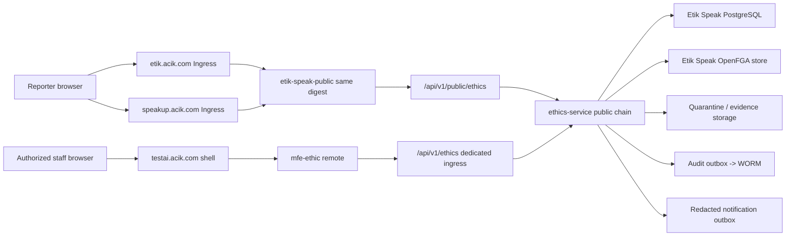

# ADR-0046 — Faz 35 Etik Speak dual-public-host ve isolated product-cell topology

## Status

Accepted for test implementation — 2026-07-18. Production activation is not
authorized by this ADR.

**Owner issues:** ES-002 [#2648](https://github.com/Halildeu/platform-k8s-gitops/issues/2648), ES-101 [#2656](https://github.com/Halildeu/platform-k8s-gitops/issues/2656)

**Product charter:** [Faz 35 Etik Speak](../faz-35-etik-speak-product-charter.md)
**Direct Anthropic review:** `claude-opus-4-8`, verdict `AGREE`, session
`db892e56-f573-47dd-80d6-a5a5a1f43b10`.

## Context

Etik Speak'in public reporter yüzeyi hesap/SSO gerektirmemeli; suite yönetici
yüzeyi ise mevcut identity, shell ve entitlement altyapısıyla çalışmalıdır.
Public bildirim içeriği ve reporter credential'ı diğer ürünlerden daha dar bir
güven alanı gerektirir. Ürün aynı zamanda tek başına satılabilmeli ve ETS,
Meeting, Endpoint veya suite arızasından etkilenmemelidir.

## Decision

### 1. Host ve artifact sınırı

- `etik.acik.com` canonical public hosttur.
- `speakup.acik.com` aynı public Service'e ve aynı immutable image digest'e
  giden tam işlevli alias'tır. Submit, receipt ve mailbox iki hostta da çalışır.
- Public uygulama ayrı `etik-speak-public` artifact/deployment/service'tir.
- Staff uygulaması mevcut `mfe-ethic` remote artifact'ıdır; testte
  `testai.acik.com/ethic`, productionda `ai.acik.com/ethic` üzerinden shell'e
  yüklenir.
- Public artifact staff MFE bundle'ını, Keycloak adapter'ını veya suite shared
  singleton'larını içermez.

### 2. API route ve credential sınırı

```text
etik.acik.com|speakup.acik.com
  /api/v1/public/ethics/*  -> ethics-service public filter chain
  /*                       -> etik-speak-public

testai.acik.com|ai.acik.com
  /api/v1/ethics/*         -> dedicated product ingress -> ethics-service staff filter chain
  /ethic                   -> shell -> mfe-ethic remote
```

Public ve staff endpoint mapping'leri aynı wildcard route altında toplanmaz.
Public API suite cookie/bearer tokenını credential olarak kabul etmez; staff API
reporter access secret'ını kabul etmez. Public endpoint case listesi, identity,
internal note veya sealed evidence okumaz.

### 3. Test-first target modeli

`testai.acik.com` yönetici MFE için authoritative test yüzeyidir. İlk test
diliminde iki public host da sentetik test product cell'e route edilir. Production
public cell hazır olduğunda weighted DNS kullanılmaz: exact ingress backend
referansı tek değişiklikle atomik olarak prod Service'e geçirilir. Önceki test
targetı en az 72 saat rollback adayı olarak korunur; production veri test cell'e
geri yönlendirilmez.

### 4. Product-cell izolasyonu

Etik Speak aşağıdakileri ürün bazında ayırır:

| Kaynak | Test kararı | Production ilkesi |
|---|---|---|
| Namespace/workloads | mevcut test namespace içinde dedicated labels, SA, quota ve NetPol; kapasite onayında dedicated namespace'e taşınabilir | dedicated namespace tercih edilir |
| PostgreSQL | ayrı database/role/schema/pool; `org_id` + `product_id` | ayrı credential ve backup/restore scope |
| OpenFGA | ayrı store/model/model-id ledger | test model promotion evidence ile |
| Vault/ESO | test Vault instance'ında `kv/platform/etik-speak`, ayrı ExternalSecret/SA | ayrı prod Vault instance'ında aynı mantıksal anahtar, ayrı credential ve named owner gate |
| Object storage | quarantine, sealed, sanitized ve export prefix/bucket policy ayrımı | ayrı KMS/policy ve lifecycle |
| Audit/notification | ayrı outbox, consumer checkpoint, retry/DLQ/backlog alarmı | provider outage product commit'ini bozmaz |
| Network | default-deny; yalnız DNS, DB, authz, storage ve allowlisted adapters | public ingress suite auth endpointine erişmez |
| Compute | requests/limits, PDB/topology ve test host kapasite guard'ı | D29 + load evidence olmadan yükseltilmez |
| Rollback | immutable digest revert + DB forward-compatible migration | 72h atomic target rollback; destructive migration yok |

Test hostunda kaynak baskısı oluşursa mevcut production workload'unu durdurmak
otomatik çözüm değildir. Önce Etik Speak requests/limits, replica ve test-only
workload kapasitesi ayarlanır. Production durdurma ayrı canlı değişiklik,
etki/rollback kanıtı ve operator yetkisi gerektirir.

### 5. Cookie, browser ve metadata sınırı

- Hiçbir response `Domain=.acik.com` cookie set etmez; host-only cookie dışında
  cookie kullanılmaz.
- Public reporter akışı mümkün olduğunca cookie'sizdir. Access secret memory veya
  explicit form input ile taşınır; URL query, localStorage ve analytics'e yazılmaz.
- Public CSP üçüncü taraf script/frame/CDN'i varsayılan reddeder.
- Referrer policy `no-referrer`, permissions policy allowlist-empty ve HSTS
  baseline uygulanır.
- IP, UA, referrer ve TLS metadata'sı reporter/case identity correlation alanı
  değildir; güvenlik rate-limit telemetry'si kısa ömürlü ve içerikten ayrıdır.

### 6. Failure isolation

- `mfe-ethic` remote yüklenmezse shell sınıflandırılmış product error boundary
  gösterir; suite'in diğer route'ları çalışır.
- Suite/Keycloak down olduğunda public intake/mailbox own-DB commit yolu çalışır.
- Notification, WORM sink veya scanner outage intake success'ini ancak ilgili
  user promise gerektiriyorsa etkiler; aksi halde durable outbox/backlog oluşur.
- DB veya required product-local policy unavailable ise public success dönmez;
  staff mutation authz outage'ta fail-closed olur.

## Runtime topology



## Deployment and rollback gates

1. Source images are built once; test overlay pins digest/imageID.
2. Kustomize render, secret scan, policy tests and resource budget pass.
3. `testai` manager and both public host D29 probes are separate.
4. Closed-loop synthetic browser journey and negative cookie/API tests pass.
5. Rollback reverts immutable image/manifest; forward-compatible DB migration
   remains readable by N-1.
6. Production promotion is a new change. Test success does not authorize
   production credentials, DNS or irreversible mutation.

## Consequences

Positive:

- public confidentiality boundary suite auth/session boundary'sinden ayrılır;
- iki marka adresi tek artifact ile drift üretmeden sunulur;
- mevcut suite yatırımı manager UX'te kullanılır;
- ürün ayrı satılabilir, bağımsız ölçeklenebilir ve geri alınabilir;
- public, staff ve downstream adapter arızaları ayrı ölçülür.

Costs/trade-offs:

- iki frontend pipeline ve iki route policy yönetilir;
- product-local DB/authz/storage daha çok kaynak ve operasyon gerektirir;
- alias host parity, cookie non-leak ve N/N-1 contract testleri kalıcı gate olur;
- standalone staff shell ES-4'e ertelenir.

## Rejected alternatives

1. **Public reporter'ı `ai.acik.com` shell içine koymak:** SSO/cookie bağımlılığı,
   confidentiality riski ve ayrı satılabilirlik kaybı nedeniyle reddedildi.
2. **`etik` ve `speakup` için ayrı build/deployment:** içerik, güvenlik header'ı
   ve release drift'i oluşturduğu için reddedildi.
3. **Public ve staff API'yi tek auth wildcard altında toplamak:** credential
   confusion ve BOLA/BFLA riskini büyüttüğü için reddedildi.
4. **Shared application schema/authz store:** cross-product blast radius ve
   deletion/retention coupling nedeniyle reddedildi.
5. **Weighted DNS cutover:** D30 atomic cutover ve rollback sözleşmesine aykırı.
6. **İlk sürümde standalone manager shell:** müşteri kapalı döngüsünü
   geciktirdiği için ES-4'e ertelendi.
