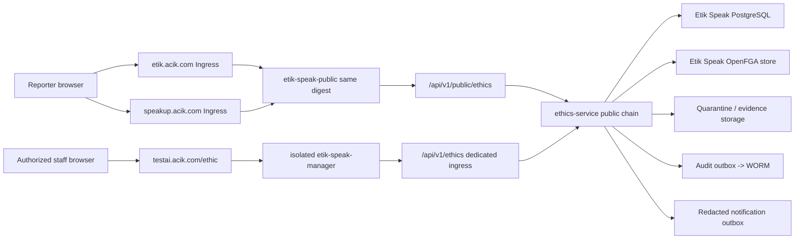

# ADR-0046 — Faz 35 Etik Speak dual-public-host ve isolated product-cell topology

## Status

Accepted for test implementation — 2026-07-18. Production activation is not
authorized by this ADR.

**Owner issues:** ES-002 [#2648](https://github.com/Halildeu/platform-k8s-gitops/issues/2648), ES-101 [#2656](https://github.com/Halildeu/platform-k8s-gitops/issues/2656)

**Product charter:** [Faz 35 Etik Speak](../faz-35-etik-speak-product-charter.md)

**Current review governance:** Faz 35, provisioning ve ES-210; #2688 veya Faz
22.6 handoff kapsamından bağımsızdır. Bunların merge veya acceptance durumu Faz
35 için bağımlılık ya da yeni gate üretmez. İstişare gerektiğinde ayrı bağlamda
doğrudan `codex exec --ephemeral --sandbox read-only` kullanılır. Rutin isteğe
bağlı kapsam exact `gpt-5.3-codex-spark xhigh`; governance, security, migration,
production ve diğer yüksek etkili kapsam exact `gpt-5.6-sol xhigh` kullanır.
Claude, MiniMax/M3, Mavis-provider, Cursor, AI uygulama penceresi,
wrapper/router ve model/provider fallback geçerli review kanalı değildir.
Bu, kullanıcı/ürün sahibi tarafından verilmiş daha yeni ve bağlayıcı karardır;
#2688 ana dala birleşene kadar repo kökündeki eski Claude-first veya çok-kanallı
metin Faz 35 için uygulanmaz ve Claude receipt'i yeni bir Faz 35 bağımlılığı
üretemez. Bu geçici authority notu production veya insan kapısını aşmaz.

`REVISE` sonrasında eski head veya scope yeniden incelenmez. Düzeltme commitinden
sonra yeni exact head, güncel base ref/base-tip, yeniden hesaplanan merge-base ve
bunlardan yeniden türetilen canonical scope/scope hash incelemeye bağlanır. Eski
bağlama ait receipt veya `AGREE` acceptance üretmez. Geçerli exact bağlam için
receipt yoksa durum `tracked_pending` kalır; current-session self-review receipt
yerine geçmez.

## Context

Etik Speak'in public reporter yüzeyi hesap/SSO gerektirmemeli; yönetici yüzeyi
ise mevcut identity ve entitlement altyapısıyla çalışmalıdır. ES-1'in temel
müşteri yolunu ortak suite image'larına bağlamadan açmak için yönetici
artifact'i de ayrı bir product-cell workload'udur.
Public bildirim içeriği ve reporter credential'ı diğer ürünlerden daha dar bir
güven alanı gerektirir. Ürün aynı zamanda tek başına satılabilmeli ve ETS,
Meeting, Endpoint veya suite arızasından etkilenmemelidir.

## Decision

### 1. Host ve artifact sınırı

- `etik.acik.com` canonical public hosttur.
- `speakup.acik.com` aynı public Service'e ve aynı immutable image digest'e
  giden tam işlevli alias'tır. Submit, receipt ve mailbox iki hostta da çalışır.
- Public uygulama ayrı `etik-speak-public` artifact/deployment/service'tir.
- ES-1 TEST staff uygulaması ayrı `etik-speak-manager`
  artifact/deployment/service'tir ve `testai.acik.com/ethic` üzerinde çalışır.
  Shared `platform-web-frontend-testai` image'ı değiştirilmez. Bu, ürün
  izolasyonu ve hızlı temel yol kararıdır; suite shell bypass'ı gizlenmez.
- Manager, mevcut `platform-test` Keycloak ve `ETHIC=MANAGE` entitlement
  altyapısını doğrudan kullanır. `check-sso` + PKCE S256 sonrası `aud` içinde
  `ethics-manager`, scope içinde `ethics:case:manage` ve realm role içinde
  `ethics-manager` üçlüsünün tamamı yoksa hassas UI render edilmez.
- TEST manager image'ı exact source head `2fae733d31f574908859307f8af0dbc375e053eb`
  ve digest `sha256:931f3432810fc2c55ec89ec0617d084a46536daf77559c53c8d0203f885a1b28`
  ile ayrı provenance taşır. Trusted main release workflow'u source auth
  unit testlerini, container HTTP/browser smoke'u ve SLSA attestation'ı
  image yayınından önce çalıştırır; GitOps preflight exact signer/source/digest
  zincirini yeniden doğrular.
- Bu source, scope'suz mevcut suite SSO tokenının manager audience/scope'una
  sessiz redirect döngüsüyle geri düşmesini engeller: bounded upgrade
  `prompt=login` ile açık yeniden doğrulama ister.
- **Auth sözleşmesi inceleme kaydı.** Aşağıdaki satırlar tarihli kayıttır, süregelen
  bir eşitlik iddiası değildir. Bu ayrım bilinçli: bu madde bir süre
  "`2fae733d...` ile current `main` arasında `apps/etik-speak-manager` farkı
  yoktur" diyordu ve o cümle, auth yolu değiştikten sonra (scope talebi ve
  `prompt: 'login'`; 12 dosya, 480 satır) **yanlış olduğu hâlde** yerinde kaldı —
  çünkü onu doğrulayan test, ADR metninin ilgili hash'i *içerdiğini* kontrol
  ediyordu, hash'in temsil ettiği olguyu değil (#3078).

  | İnceleme tarihi | İncelenen kaynak | Auth yüzeyi digest'i |
  |---|---|---|
  | 2026-07-18 | `2fae733d31f574908859307f8af0dbc375e053eb` | (çapa henüz yoktu) |
  | 2026-07-28 | `apps/etik-speak-manager/src/{AuthGate.tsx,auth.ts}` | `1a3de9db7d91ec402f5b1ca1dde66069130c7eb4e0e5ad076f3f4af2d54141de` |

  Süregelen koruma bu metinde değil, kaynağın bulunduğu repodadır:
  `apps/etik-speak-manager/src/auth-contract-anchor.test.ts` auth yüzeyi
  değiştiğinde fail-closed kırılır ve inceleme ister. Sözleşmenin **davranışı**
  ise ayrıca ve asıl olarak `AuthGate.test.tsx` + `auth-lifecycle.test.ts`
  tarafından korunur (PKCE, sessiz `check-sso`, tam scope/audience, sınırlı
  `prompt=login`, claim kaybında fail-closed, geçersizleşmede unmount). Buradaki
  digest bir garanti değil, o incelemenin yapıldığı ana ait bir kayıttır.

  gitops CI'ının platform-web checkout'u yoktur; bu repodan o dizin hakkında
  kurulan her süregelen iddia yapısı gereği yanlışlanamaz. Kontrolün kaynağın
  yanında durmasının sebebi budur.
- Public artifact staff MFE bundle'ını, Keycloak adapter'ını veya suite shared
  singleton'larını içermez.

### 2. API route ve credential sınırı

```text
etik.acik.com|speakup.acik.com
  /api/v1/public/ethics/*  -> ethics-service public filter chain
  /*                       -> etik-speak-public

testai.acik.com|ai.acik.com
  /api/v1/ethics/*         -> dedicated product ingress -> ethics-service staff filter chain
  /ethic                   -> ES-1 isolated etik-speak-manager
```

Public ve staff endpoint mapping'leri aynı wildcard route altında toplanmaz.
Public API suite cookie/bearer tokenını credential olarak kabul etmez; staff API
reporter access secret'ını kabul etmez. Public endpoint case listesi, identity,
internal note veya sealed evidence okumaz.

### 3. Test-first target modeli

`testai.acik.com/ethic` izole yönetici SPA için authoritative test yüzeyidir. İlk test
diliminde iki public host da sentetik test product cell'e route edilir. Production
public cell hazır olduğunda weighted DNS kullanılmaz: exact ingress backend
referansı tek değişiklikle atomik olarak prod Service'e geçirilir. Önceki test
targetı en az 72 saat rollback adayı olarak korunur; production veri test cell'e
geri yönlendirilmez.

### 4. Product-cell izolasyonu

Etik Speak aşağıdakileri ürün bazında ayırır:

| Kaynak | Test kararı | Production ilkesi |
|---|---|---|
| Namespace/workloads | mevcut test namespace içinde dedicated labels, SA, quota ve NetPol; kapasite onayında dedicated namespace'e taşınabilir | dedicated namespace tercih edilir |
| PostgreSQL | ayrı database/role/schema/pool; `org_id` + `product_id` | ayrı credential ve backup/restore scope |
| OpenFGA | ayrı store/model/model-id ledger | test model promotion evidence ile |
| Vault/ESO | test Vault instance'ında `kv/platform/etik-speak`, ayrı ExternalSecret/SA | ayrı prod Vault instance'ında aynı mantıksal anahtar, ayrı credential ve named owner gate |
| Object storage | quarantine, sealed, sanitized ve export prefix/bucket policy ayrımı | ayrı KMS/policy ve lifecycle |
| Audit/notification | ayrı outbox, consumer checkpoint, retry/DLQ/backlog alarmı | provider outage product commit'ini bozmaz |
| Network | default-deny; yalnız DNS, DB, authz, storage ve allowlisted adapters | public ingress suite auth endpointine erişmez |
| Compute | requests/limits, PDB/topology ve test host kapasite guard'ı | D29 + load evidence olmadan yükseltilmez |
| Rollback | immutable digest revert + DB forward-compatible migration | 72h atomic target rollback; destructive migration yok |

Test hostunda kaynak baskısı oluşursa mevcut production workload'unu durdurmak
otomatik çözüm değildir. Önce Etik Speak requests/limits, replica ve test-only
workload kapasitesi ayarlanır. Production durdurma ayrı canlı değişiklik,
etki/rollback kanıtı ve operator yetkisi gerektirir.

### 5. Cookie, browser ve metadata sınırı

- Hiçbir response `Domain=.acik.com` cookie set etmez; host-only cookie dışında
  cookie kullanılmaz.
- Public reporter akışı mümkün olduğunca cookie'sizdir. Access secret memory veya
  explicit form input ile taşınır; URL query, localStorage ve analytics'e yazılmaz.
- Public CSP üçüncü taraf script/frame/CDN'i varsayılan reddeder.
- Referrer policy `no-referrer`, permissions policy allowlist-empty ve HSTS
  baseline uygulanır.
- IP, UA, referrer ve TLS metadata'sı reporter/case identity correlation alanı
  değildir; güvenlik rate-limit telemetry'si kısa ömürlü ve içerikten ayrıdır.

### 6. Failure isolation

- `etik-speak-manager` yüklenmezse yalnız `/ethic` yönetici yolu etkilenir;
  shared suite frontend ve diğer ürün route'ları aynı workload'u paylaşmaz.
- Keycloak oturumu geçersizleşir, token refresh başarısız olur veya staff API
  `401/403` dönerse manager bearer provider'ı temizler ve hassas vaka içeriğini
  derhal unmount eder. API istekleri `credentials: omit` kullanır; caller
  `Authorization` veya `Cookie` enjekte edemez.
- Suite/Keycloak down olduğunda public intake/mailbox own-DB commit yolu çalışır.
- Notification, WORM sink veya scanner outage intake success'ini ancak ilgili
  user promise gerektiriyorsa etkiler; aksi halde durable outbox/backlog oluşur.
- DB veya required product-local policy unavailable ise public success dönmez;
  staff mutation authz outage'ta fail-closed olur.

## Runtime topology



## Deployment and rollback gates

1. Source images are built once; test overlay pins digest/imageID.
2. Kustomize render, secret scan, policy tests and resource budget pass.
3. `testai` manager and both public host D29 probes are separate.
4. Closed-loop synthetic browser journey and negative cookie/API tests pass.
5. Rollback reverts immutable image/manifest; forward-compatible DB migration
   remains readable by N-1.
6. Production promotion is a new change. Test success does not authorize
   production credentials, DNS or irreversible mutation.

## Consequences

Positive:

- public confidentiality boundary suite auth/session boundary'sinden ayrılır;
- iki marka adresi tek artifact ile drift üretmeden sunulur;
- mevcut Keycloak ve entitlement yatırımı manager UX'te kullanılır;
- ürün ayrı satılabilir, bağımsız ölçeklenebilir ve geri alınabilir;
- public, staff ve downstream adapter arızaları ayrı ölçülür.

Costs/trade-offs:

- iki frontend pipeline ve iki route policy yönetilir;
- product-local DB/authz/storage daha çok kaynak ve operasyon gerektirir;
- alias host parity, cookie non-leak ve N/N-1 contract testleri kalıcı gate olur;
- suite-shell/MFE paketleme adaptörü ES-4'e ertelenir; ES-1 isolated manager
  artifact'i temel kapalı döngünün canonical TEST yüzeyidir.

## Rejected alternatives

1. **Public reporter'ı `ai.acik.com` shell içine koymak:** SSO/cookie bağımlılığı,
   confidentiality riski ve ayrı satılabilirlik kaybı nedeniyle reddedildi.
2. **`etik` ve `speakup` için ayrı build/deployment:** içerik, güvenlik header'ı
   ve release drift'i oluşturduğu için reddedildi.
3. **Public ve staff API'yi tek auth wildcard altında toplamak:** credential
   confusion ve BOLA/BFLA riskini büyüttüğü için reddedildi.
4. **Shared application schema/authz store:** cross-product blast radius ve
   deletion/retention coupling nedeniyle reddedildi.
5. **Weighted DNS cutover:** D30 atomic cutover ve rollback sözleşmesine aykırı.
6. **ES-1'i shared suite image'ı içinde yayınlamak:** ortak frontend
   promotion'ı ve bağımsız ürün blast-radius'ı temel kapalı döngüyü
   geciktirdiği için reddedildi. ES-4, isolated manager'ın yerine geçmek
   zorunda olmayan ayrı bir suite-integration packaging adaptörüdür.
