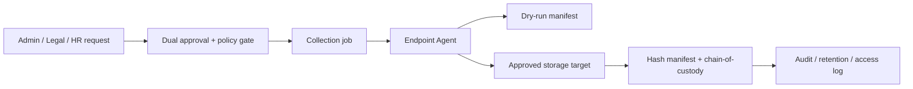

# Faz 22.8 - Endpoint Data Protection & Forensic Collection

> **Status**: PLANNING / BLOCKED by Sensitive Endpoint Ops Governance Gate.
> **Created**: 2026-06-09
> **Board / issue authority**:
> - platform-k8s-gitops [#1388](https://github.com/Halildeu/platform-k8s-gitops/issues/1388) - sensitive endpoint ops governance gate
> - platform-k8s-gitops [#1389](https://github.com/Halildeu/platform-k8s-gitops/issues/1389) - phase boundary sync
> - platform-k8s-gitops [#1390](https://github.com/Halildeu/platform-k8s-gitops/issues/1390) - 22.8 charter
> - platform-agent [#117](https://github.com/Halildeu/platform-agent/issues/117) - backup dry-run manifest

Bu doküman, endpoint verisi için planlı yedekleme, işten çıkışta kontrollü veri
toplama ve denetim/soruşturma amaçlı forensic collection hattını tanımlar. Bu
kapsam Faz 22.5 AG-034 SMB/file action discovery'den türemiştir, fakat runtime
file copy veya kullanıcı dosyası toplama **22.5 içinde açılmaz**.

## 1. Amaç

- Kurumsal veri kaybını azaltmak için policy kontrollü endpoint backup hattı
  tasarlamak.
- Offboarding sürecinde şirket verisinin kontrollü ve auditli şekilde
  toplanmasını sağlamak.
- Denetim veya soruşturma durumunda chain-of-custody bozulmadan endpoint veri
  koleksiyonu yapabilmek.

## 2. Faz Sınırı

| Kapsam | Faz | Karar |
|---|---:|---|
| AG-034 SMB/file action discovery, threat model, whitelist tasarımı | 22.5.X | Discovery only; runtime yok |
| Remote support tunnel / interaktif erişim | 22.6 | Ayrı Remote Access Bridge |
| Compliance aggregate reporting / mart layer | 22.7 | Zaten platform-backend #376 tarafından sahiplenildi |
| Backup / offboarding / forensic collection | 22.8 | Bu dokümanın kapsamı |

## 3. Substream'ler

| Substream | Kapsam | İlk güvenli adım |
|---|---|---|
| **22.8A Scheduled endpoint backup** | Kullanıcı/kurum verisi için policy kontrollü scheduled backup | Agent dry-run manifest: dosya kopyalamadan path, size, count, denylist/allowlist raporu |
| **22.8B Offboarding copy** | İşten çıkışta şirket verisini kaybetmeden toplama | HR/IT request + dual approval + bounded collection policy |
| **22.8C Forensic collection** | Denetim/soruşturma amaçlı evidence collection | Legal case id + chain-of-custody + immutable manifest |

## 4. Non-goals

- Kullanıcı bilgisayarında serbest dosya gezme veya keyfi path kopyalama.
- Browser profile, saved credential, token, private key, mailbox cache veya
  şifre yöneticisi datası toplama.
- Hidden bulk copy. Kullanıcı/IT/legal policy gerektiren işler gizli otomasyon
  olarak açılmaz.
- 22.5 install/uninstall komutlarına dosya toplama kabiliyeti eklemek.
- Sensitive ops governance gate kapanmadan runtime copy başlatmak.

## 5. Hedef Mimari

Runtime copy gelmeden önce 22.8A dry-run manifest gerekir. Agent önce hangi
path sınıflarını, toplam boyutu, dosya sayısını, denylist ihlallerini ve
policy eşleşmesini raporlar; içerik kopyalama ayrı approval ve storage
kontratı olmadan açılmaz.

## 6. Storage Kararı

Varsayılan hedef object storage veya dedicated evidence storage olmalıdır.
SMB share yalnız aşağıdaki şartlarla kabul edilebilir:

- Dedicated share, genel kullanıcı paylaşımlarından ayrı.
- Server-side encryption veya disk encryption.
- Per-case veya per-job ACL.
- Write-once veya immutable retention seçeneği.
- Hash manifest ve transfer audit'i.
- Operator access log ve retention policy.

SMB "kolay kopyalama" olarak değil, denetlenebilir evidence storage olarak
tasarlanır.

## 7. Milestone Planı

| Milestone | Kapsam | Acceptance |
|---|---|---|
| **22.8.0 Charter / governance** | #1390 charter + #1388 sensitive ops gate kararları | Runtime copy blocked until accepted |
| **22.8A.1 Dry-run manifest** | Agent path allowlist/denylist, count/size/hash-plan manifest | #117; no file content copied |
| **22.8A.2 Backup policy contract** | Path classes, schedule, retention, bandwidth/window limits | Policy review + fixture set |
| **22.8A.3 Storage connector contract** | Object/evidence storage or controlled SMB target | ACL/encryption/audit evidence |
| **22.8B.1 Offboarding workflow** | HR/IT request, dual approval, handoff package | Audit + owner + expiry |
| **22.8C.1 Forensic workflow** | Case id, chain-of-custody, immutable manifest | Legal/IT accepted runbook |
| **22.8 Pilot** | 2-5 cihaz dry-run, then bounded copy if gate accepted | D29 Up + Functional + Secured evidence |

## 8. KVKK / Legal / Audit Guard

- Legal basis ve purpose limitation yazılı olur.
- Data minimization: default allowlist dar, denylist güçlü.
- Kullanıcı kişisel verisi ile şirket verisi ayrımı policy'de açık yazılır.
- Retention süresi ve deletion workflow'u issue/runbook'ta belirtilir.
- Evidence erişimi role-based ve auditli olur.
- Chain-of-custody: request id, approver, device id, manifest hash, transfer
  hash, storage URI, timestamp ve access log birlikte tutulur.

## 9. D29 Acceptance Model

| Katman | Kanıt |
|---|---|
| **Up** | Backend job surface, storage target config ve agent dry-run capability disabled-by-default şekilde ayakta |
| **Functional** | Dry-run manifest doğru path/size/count/policy sonucu üretir; approved bounded copy varsa hash manifest ile tamamlanır |
| **Secured** | RBAC + dual-control + legal case/retention + chain-of-custody + denylist enforce edilir |

22.8 için "yedekleme var" iddiası yalnız bu üç katman ayrı kanıtlandığında
kurulabilir.

## 10. Board Mapping

| Issue | Rol | Status yorumu |
|---|---|---|
| gitops #1388 | Sensitive Endpoint Ops Governance Gate | BLOCKED/P0; runtime copy ön koşulu |
| gitops #1390 | 22.8 charter | BLOCKED by #1388 |
| agent #117 | 22.8A dry-run manifest | BLOCKED by #1388/#1390; no runtime copy |
| gitops #1389 | Phase boundary sync | 22.5/22.6/22.7/22.8 ayrımını canonical tutar |
