# Faz 22.8 — Endpoint Data Protection & Forensic Collection

> **Status**: PLANNING / **BLOCKED** — üç kapı:
> 1. [#1388](https://github.com/Halildeu/platform-k8s-gitops/issues/1388) Sensitive Endpoint Ops Governance Gate (owner/DPO/legal)
> 2. [#1390](https://github.com/Halildeu/platform-k8s-gitops/issues/1390) 22.8 charter
> 3. ADR-0012-EA §0 governance migration (DD-EA-9 + DC-EA axis canonical olmadan runtime copy yok)
>
> **Created**: 2026-06-09 · **System-fit revision**: 2026-06-09
> **Cross-AI consensus**: Implementer Claude (Opus 4.8) / Reviewer Codex (OpenAI) — thread `019ea961`, **REVISE → AGREE** (2 tur).
> **Board**: gitops #1388 / #1389 / #1390 / #1399 (22.8A backup engine matrix) / #1400 (OSS-only build-vs-buy) / #1403 (Velociraptor clean-room ADR) / #1404 (YARA/osquery/Sigma), platform-agent [#117](https://github.com/Halildeu/platform-agent/issues/117) (22.8A dry-run manifest)
> **İlişkili**: [ADR-0012-EA](adr/0012-EA-endpoint-admin-governance-charter.md) (extended ladder + DD-EA), [22.6 plan](faz-22-remote-access-bridge-plan.md) + [ADR-0033](adr/0033-faz-22-6-remote-access-bridge-broker.md) + [#1388 acceptance package](faz-22-6-1388-acceptance-package.md) (evidence-storage-contract tüketicisi)

Bu doküman, endpoint verisi için **planlı yedekleme**, **işten çıkışta kontrollü
veri toplama** ve **denetim/soruşturma forensic collection** hattını tanımlar.
Kapsam Faz 22.5 AG-034 SMB/file-action discovery'den türemiştir, fakat runtime
file copy / kullanıcı dosyası toplama **22.5 içinde açılmaz**.

> **Bu revizyonun risk ekseni (sistem uyumu):** 22.6 (Remote Access) riski
> **interaktif komut/kontrol** (broker C2) iken, **22.8 riski kitlesel VERİ
> EXFILTRASYONU / mahremiyet**tir. En kötü durum: *onaylı bir toplama job'ı,
> imzalı bir exfil kanalıdır — tek hatalı policy ya da bypass binlerce dosyayı
> dışarı taşır.* Bu, tüm endpoint programının **en yüksek mahremiyet-yükümlülüğü
> + insider-threat yüzeyi**dir. Plan bu eksene göre sertleştirilmiştir.

---

## §0 — Governance Binding (DC-EA axis + DD-EA-9, planning-only)

> **Bu plan merge edilebilir; runtime copy YASAK** — #1388 + #1390 + ADR-0012-EA
> §0 migration + DPO/legal sign-off (forensic ek olarak legal/judicial dayanak)
> olmadan içerik kopyalama başlamaz.

**Data-Collection Severity Axis (DC-EA) — D35-EA komut merdiveninden AYRI eksen.**
D35-EA "hangi agent action sınıfı çalışıyor?" sorusuna; DC-EA "data riski nedir?"
sorusuna cevap verir. İkisini karıştırmak ("read-only" kelimesi exfil riskini
gizler) yasak.

| Tier | Kapsam | Gate |
|---|---|---|
| **DC-EA-0** | data collection disabled / capability absent | — (default) |
| **DC-EA-1** | **metadata-only dry-run** (içerik OKUNMAZ) | read-only probe; disabled-by-default |
| **DC-EA-2** | bounded scheduled backup | company-managed allowlist + dual-control/policy approval |
| **DC-EA-3** | offboarding company-data recovery | HR/IT/DPO gated + manifest review |
| **DC-EA-4** | forensic collection | legal `case_id` + M-of-N + chain-of-custody |
| **DC-EA-RED** | credential / browser profile / token / private-key / mailbox cache / DPAPI store / registry hive / password-manager vault | **HER ZAMAN DENY** |

> **DC-EA-RED "always deny" = routine/backup/offboarding için MUTLAK.** Forensic'te
> bir mahkeme kararı RED sınıfa erişim gerektiriyorsa bu **22.8C normal akış
> değildir**: ayrı **legal/judicial exception + explicit case order + ayrı
> break-glass/legal-hold gate** gerektirir (DC-EA-RED'i routine flow'da hiçbir
> şey override edemez).

**YENİ guard — DD-EA-9 Data Collection Governance Guard** (ADR-0012-EA §0 ile
eklenir, PROPOSED): CI gate — bounded allowlist profili + **agent-side hardcoded
denylist (policy ile gevşetilemez)** + path canonicalization-before-decision +
backend server-side mirror + dry-run-before-content + manifest-before-upload +
post-upload quarantine DLP scan + disabled-capability-not-advertised (AG-013).

## §1 — Amaç

- Kurumsal veri kaybını azaltmak için **policy-kontrollü endpoint backup** hattı.
- Offboarding'de şirket verisinin **kontrollü + auditli** toplanması (kişisel
  veriye dokunmadan).
- Denetim/soruşturmada **chain-of-custody bozulmadan** forensic koleksiyon.

## §2 — Faz Sınırı

| Kapsam | Faz | Karar |
|---|---:|---|
| AG-034 SMB/file-action **discovery** (runtime yok) | 22.5.X | Discovery only |
| Remote support tunnel / interaktif erişim | 22.6 | Ayrı Remote Access Bridge |
| Compliance aggregate reporting / mart | 22.7 | platform-backend #376 (LIVE testai) |
| Backup / offboarding / forensic collection | **22.8** | Bu doküman |

## §3 — Substream'ler

| Substream | DC-EA | İlk güvenli adım |
|---|---|---|
| **22.8A Scheduled backup** | DC-EA-1 → DC-EA-2 | Agent **metadata-only dry-run manifest** (path-class/size/mtime-bucket/owner-scope/count — **içerik hash YOK**) → policy → approval → bounded content |
| **22.8B Offboarding copy** | DC-EA-3 | HR/IT request + dual approval + **company-managed scope proof** (§8) + manifest review |
| **22.8C Forensic collection** | DC-EA-4 | Legal `case_id` + chain-of-custody + immutable manifest + quarantine |

### §3.1 — OSS-only Engine / Tool Kararları (PR #1395 absorb)

> **Canonical karar: [ADR-0036](./adr/0036-faz-22-oss-build-vs-buy.md)** (owner 2026-06-09) — 22.8A **dry-run manifest in-house build** (file-walk + **metadata-only**: path-class/size/mtime-bucket/owner-scope/count + allow/deny; **içerik okuma/içerik hash YOK** — DC-EA-1 invariant, content hash onaylı bounded-content/copy yetkisine ertelenir); **Kopia yalnız gerçek copy/restore/retention gerekirse wrap**; Velociraptor yalnız DFIR reactivation (#1403); YARA yalnız dosya-içerik IOC/malware/imza scan gerektiğinde (secret-scan ayrı scanner sınırı). Aşağıdaki tablo ADR-0036 §2 ile **decision-closed** — gerekçe referansı.

> Faz 22.8 kararı "dosya kopyalayan bir aracı alıp çalıştırmak" **değildir**.
> Endpoint-admin policy/approval/audit/retention/chain-of-custody katmanlarını
> **kendi üretir**; OSS araçlar yalnız **bounded engine / storage transport /
> scanner / forensic reference** rolü alır — hepsi **DD-EA-9** (§6) ile sarmalanır,
> output **evidence-storage-contract** (§7 / [ADR-0035](adr/0035-evidence-storage-contract.md))'a gider.

**22.8A backup engine matrix (#1399):**

| Araç | Karar | Sistem-fit notu |
|---|---|---|
| **Kopia** | **WRAP-only-if-real-copy** (ADR-0036; Apache-2.0; cross-platform snapshot/dedup/encryption) | Dry-run in-house metadata-only; Kopia yalnız gerçek backup **copy** + repo lifecycle + restore drill + retention devreye alınırsa DD-EA-9 wrapper içinde wrap edilir; **dry-run metadata-only invariant'ını (§5) bozmaz** |
| restic | **HISTORICAL / not selected** (ADR-0036) | Dry-run in-house; gerçek-copy fallback gerekirse ayrı ADR (Cat-3 listesi Kopia ile sınırlı) |
| BorgBackup | **HISTORICAL / not selected** (ADR-0036) | Windows service ergonomics pursued edilmedi |
| Duplicati | **SKIP / license boundary** (ADR-0036) | `proprietary/` boundary = OSS-only ihlali; not selected |
| rclone | **TRANSPORT-REFERENCE ONLY** (ADR-0036) | §9 scoped write-only upload transport helper'ı; backup/snapshot engine **değil**; storage transport adoption gerekirse ayrı ADR + #1388/DPA |
| Own dedup/encryption engine | **REJECT** | platform wrapper/policy/audit yazar, backup internals yazmaz |

**22.8B offboarding:** serbest SMB copy **değil** — 22.8A engine'i bounded
collection + handoff package workflow'unda yeniden kullanır; SMB hedef yalnız
ADR-0035 §1 (per-case ACL/encryption/WORM-equiv/audit) gate'leriyle.

**22.8C forensic matrix:**

| Araç | Karar | Sistem-fit notu |
|---|---|---|
| **Velociraptor** | **reactivation-trigger only** (ADR-0036) | AGPL + ikinci control-plane riski → standing server YOK; yalnız DFIR artifact-collection/live-hunt gerçekten landerse (22.8C clean-room + legal gate #1403) re-evaluate edilir; standing wrap değil |
| **YARA** | **WRAP-only-if-scan** (ADR-0036) | Yalnız **dosya-içerik IOC/malware/imza** scan gerektiğinde wrap; **secret/credential-scan AYRI scanner sınırı** olabilir (YARA otomatik cevap değil); §6 bounded job + resource cap |
| osquery | **SKIP** (ADR-0036) | Posture zaten in-house (AG-*); ayrı fleet manager/query motoru gereksiz |
| Sigma rules | **SKIP** (ADR-0036; DRL 1.1 license-gated) | DRL 1.1 standart permissive OSS değil; attribution/legal gate olmadan rule reuse yok |
| Wazuh | **SKIP / reject-as-core** (ADR-0036) | full SIEM/HIDS = ikinci control plane + ağır ops footprint |

## §4 — Non-goals (DC-EA-RED + sınırlar)

- Serbest dosya gezme / **arbitrary path copy**.
- DC-EA-RED sınıfları: browser profile, saved credential, token, private key,
  mailbox cache, password-manager, DPAPI store, registry hive.
- Hidden bulk copy / gizli otomasyon.
- 22.5 install/uninstall komutlarına dosya toplama eklemek.
- Sensitive-ops gate (#1388) kapanmadan runtime copy.
- **Archive/container leakage:** `zip/7z/pst/ost/vhd/vmdk` gibi container'lar
  path canonicalization ile bitmez — **release öncesi recursive classification
  zorunlu** veya default quarantine (RED veri arşiv içinde gizlenebilir).

## §5 — Hedef Mimari (metadata-only dry-run → approval → bounded content)

```mermaid
flowchart LR
  Req["Admin / Legal / HR request"] --> Appr["Dual approval + policy gate + (forensic) case_id"]
  Appr --> Dry["DC-EA-1 metadata-only dry-run manifest (içerik okunmaz)"]
  Dry --> Review["HR/IT/DPO manifest review (offboarding/forensic)"]
  Review --> Job["Bounded collection job (allowlist + hardcoded denylist)"]
  Job --> Agent["Endpoint Agent (path canonicalization → decision)"]
  Agent -- "scoped write-only cred (§9)" --> Store["Object storage (WORM/object-lock)"]
  Store --> Final["Finalization: object hash/size == manifest"]
  Final --> Quar["Quarantine + DLP/secret scan"]
  Quar --> Evidence["Signed manifest + chain-of-custody + access audit"]
```

**Akış prensibi:** önce **metadata-only dry-run** (içerik okumadan); denylist +
company-managed allowlist + approval sonrası yalnız **eligible** dosyalar için
content (ve gerekiyorsa hash) işlenir; **denylisted path'lere hash bile
alınmaz**; hash manifest **sensitive evidence**'tır (log/PR/public'e düz basılmaz).

## §6 — DD-EA-9 Data Collection Governance Guard

- **Allowlist-FIRST (primary control):** backend-side bounded allowlist profili;
  denylist ikincil emniyet.
- **Agent-side hardcoded denylist:** DC-EA-RED sınıfları policy ile gevşetilemez.
- **Path canonicalization BEFORE decision:** symlink / junction / reparse-point /
  UNC / **ADS (alternate data streams)** / long-path / cloud-sync-root /
  archive-container resolution → sonra karar (Windows bypass yüzeyi geniş).
- **Backend server-side mirror:** aynı karar motorunun sunucu tarafı kopyası
  (agent'a güvenilmez; çift doğrulama).
- **Dry-run-before-content + manifest-before-upload.**
- **Post-upload quarantine DLP/secret-scan** → access release öncesi.
- **Disabled-capability-not-advertised** (AG-013 precedent).

## §7 — Evidence-Storage-Contract v0 (22.8 OWNS; 22.6 tüketir)

> 22.8 bu contract'ın **primary definer**'ıdır (22.8C forensic en sıkı tüketici).
> 22.6 session recording'leri aynı contract'ı **tüketir** (ayrı tasarım YOK).
> Standartlar: **ISO/IEC 27037** (digital evidence), **ISO 27040** (storage
> security), **NIST SP 800-86** (forensic).

- **Object storage + object-lock / WORM**; per-case object prefix; **legal-hold
  flag**; ACL; encryption-at-rest.
- **Per-object:** SHA-256 + size + path-class + source-device + collector-identity
  + timestamp.
- **Manifest backend/control-plane tarafından imzalanır** (yalnız agent değil).
- **Upload finalization:** object hash/size **manifest ile eşleşmeden** "collected"
  state'e geçilmez.
- **Crypto-erase: per-case KMS key.** **WORM-uyumlu:** object-lock retention /
  legal-hold dolmadan silme/crypto-erase **yapılamaz**; KMS key destruction
  retention + legal-hold bitiminden **sonra** uygulanır.
- **Access events = immutable audit row** (read'ler write kadar önemli).
- **Quarantine state** → DPO/legal release öncesi (özellikle 22.8C).

## §8 — 22.8B Company-vs-Personal Veri Ayrımı (en kritik hukuk kontrolü)

> "Company-managed scopes only" **gerekli ama yeterli değil** — kanıt gerekir.
> Çalışma/BYOD cihazda çalışanın **kişisel** dosyaları ≠ şirket verisi; offboarding
> **yalnız ŞİRKET verisini** toplayabilir.

- **`managed_data_root` registry:** {root path, source type, owner, tenant/share
  ID, legal-basis candidate, retention profile, allowed subpaths}.
- **Proof classes:** OneDrive-for-Business tenant ID / SharePoint site ID /
  corporate-UNC allowlist / signed IT-managed-folder marker / MDM-GPO policy root.
- **BYOD default:** yalnız pre-managed container/sync root; personal
  Documents / Desktop / Pictures / Downloads **default DENY**.
- **Offboarding sırası:** HR/IT/DPO **dry-run manifest'i içerikten ÖNCE inceler**;
  yalnız seçili şirket root'ları ilerler.
- Company-managed root içindeki **kişisel dosyalar yine minimization + redaction /
  DPO review** ister (managed-root ≠ her dosya güvenli).
- **Kişisel klasördeki şirket dosyası** routine-collectible DEĞİL → gerekiyorsa
  **legal/forensic path**, offboarding değil.

## §9 — Transport (agent → object-storage, scoped write-only credential)

Büyük dosyalar backend'den **geçmez**; agent **doğrudan object storage**'a
yükler, ama credential aşırı kısıtlı:
- **Write-only** (read/list/delete YOK); per-job + per-object-prefix.
- **Short TTL** (dakikalar, saatler değil).
- Content-length + multipart-part cap; required checksum header.
- Tenant/device/job binding (object key + metadata).
- Agent **yalnız onaylı object-storage endpoint**'ine ulaşır (arbitrary egress YOK).
- Finalization backend manifest doğrulaması gerektirir.
- Max-jobs/concurrency/rate cap → **reject** (unbounded queue YOK).
- **SMB fallback:** yalnız per-case isolated write target (ACL/encryption/
  write-once/hash-manifest/audit); genel share **kabul edilmez**.

## §10 — KVKK / Legal / Audit (unsealed + DPIA/VERBİS mandatory)

- **Legal basis kilitlenmez** (DPO/Hukuk karar verir), candidate per substream:
  - 22.8A backup: m.5/2-f meşru menfaat / iş sözleşmesi (DLP).
  - 22.8B offboarding: iş sözleşmesi / meşru menfaat (şirket verisi geri kazanımı).
  - 22.8C forensic: m.5/2-ç hukuki yükümlülük / meşru menfaat / olası yargısal
    (m.28 istisnaları).
- **Program gate (mandatory):** **DPIA / KVKK risk assessment** + **VERBİS
  impact-check**. (Gerçek VERBİS kayıt/güncelleme + bağlayıcı dayanak = DPO/Hukuk
  kararı; sonuç önceden mühürlenmez.)
- Data minimization (m.4): dar allowlist, güçlü denylist, per-job/per-case scope.
- Chain-of-custody: `request_id`, approver, device, manifest hash, transfer hash,
  storage URI, timestamp, access log — `docs/22-2-kvkk-data-inventory.md` + BE-019.

## §11 — Milestone Planı

| Milestone | DC-EA | Kapsam | Acceptance |
|---|---|---|---|
| **22.8.0 Charter / governance** | — | #1390 charter + #1388 gate + ADR-0012-EA §0 (DD-EA-9 + DC-EA) | Runtime copy blocked until accepted |
| **22.8A.1 Dry-run manifest** | DC-EA-1 | Agent metadata-only manifest (**içerik hash YOK**) | #117; no file content read |
| **22.8A.2 Backup policy contract** | DC-EA-2 | Path classes, allowlist, schedule, retention, bandwidth/window | Policy review + fixture |
| **22.8A.3 Storage connector + evidence-storage-contract v0** | — | Object storage (WORM) + scoped write-only upload + finalization | ACL/encryption/object-lock/audit evidence |
| **22.8B.1 Offboarding workflow** | DC-EA-3 | `managed_data_root` proof + HR/IT/DPO manifest review | Audit + owner + expiry + company-scope proof |
| **22.8C.1 Forensic workflow** | DC-EA-4 | case_id + M-of-N + chain-of-custody + quarantine | Legal/IT runbook + judicial path for RED |
| **22.8 Pilot** | — | 2-5 cihaz dry-run, sonra bounded copy (gate kabulüyle) | D29 Up + Functional + Secured |

## §12 — D29 Acceptance Model

| Katman | Kanıt |
|---|---|
| **Up** | Backend job surface + storage target config + agent dry-run capability **disabled-by-default** ayakta |
| **Functional** | Metadata-only dry-run doğru path/size/count/policy üretir; approved bounded copy hash manifest + finalization ile tamamlanır |
| **Secured** | DD-EA-9 (allowlist-first + hardcoded denylist + canonicalization + backend mirror) + dual-control + legal case/retention + chain-of-custody + WORM + quarantine + DC-EA-RED deny enforce |

> + **G8 Privacy/Legal gate** (D29 4. pillar DEĞİL, ayrı P0): DPIA + VERBİS-check +
> per-substream legal basis (DPO/Hukuk).

## §13 — Sistem-Fit Risk Register

| Risk | Seviye | Not |
|---|---|---|
| **Silent bulk copy** (onaylı job = imzalı exfil kanalı) | **P0** | DD-EA-9 + dry-run-first + dual-control + scoped write-only cred + caps |
| Bypassable path normalization (symlink/junction/UNC/ADS/long-path) | P0 | canonicalization-before-decision + backend mirror |
| Forged managed-root | P1 | proof classes (§8) + signed marker / tenant ID doğrulama |
| Overbroad presigned credential | P1 | write-only + per-object-prefix + short-TTL + caps |
| Archive/container leakage (zip/pst/ost/vhd) | P1 | recursive classification / quarantine before release |
| Orphaned upload creds | P2 | short-TTL + job-bound + revoke on finalize |
| Legal-case abuse (insider forensic) | P0 | case_id + M-of-N + immutable access audit + judicial path |
| Post-upload access abuse | P1 | least-priv viewer + per-view audit + quarantine + DPO-mediated |
| Personal-data over-collection | P0 | company-managed scope proof + DPO manifest review (§8) |
| Manifest tampering | P1 | control-plane-signed manifest + finalization hash match + BE-016 chain |

## §14 — #1388 Acceptance Package Katkıları

22.8, [#1388 acceptance package](faz-22-6-1388-acceptance-package.md)'a kendi
substream-spesifik kriterlerini ekler: DC-EA axis + DD-EA-9; hard-denylist /
bounded-allowlist; company-vs-personal proof; chain-of-custody + WORM storage;
per-substream legal basis (DPIA/VERBİS); transport scoped-cred; archive recursive
classification. (#1388 gate 22.6 + 22.8 için ortak; her faz kendi kriterlerini
besler.)

## §15 — Board Mapping

| Issue | Rol | Status |
|---|---|---|
| gitops #1388 | Sensitive Endpoint Ops Governance Gate | BLOCKED/P0; runtime copy önkoşulu |
| gitops #1389 | Phase boundary sync | 22.5/22.6/22.7/22.8 canonical |
| gitops #1390 | 22.8 charter | BLOCKED by #1388 (bu plan charter'ı besler) |
| agent #117 | 22.8A dry-run manifest | BLOCKED by #1388/#1390; **metadata-only, içerik hash YOK** |
| gitops #1399 | 22.8A backup engine matrix | **CLOSED by ADR-0036**: dry-run in-house metadata-only; Kopia wrap-only-if-real-copy |
| gitops #1400 | OSS-only build-vs-buy decision matrix | **DECISION-CLOSED by ADR-0036** (Cat1+2 in-house); runtime yetkisi vermez |
| gitops #1403 | Velociraptor clean-room/legal ADR | 22.8C forensic boundary; ADR-0036: reactivation-trigger only (AGPL/2nd-control-plane) |
| gitops #1404 | YARA/osquery/Sigma scanner reference | **CLOSED by ADR-0036**: posture in-house; YARA wrap-only-if-scan; osquery/Sigma/Wazuh skip |
| **YENİ** | ADR-0012-EA §0 DD-EA-9 + DC-EA axis migration | #1388 altında (22.6 §0 ile ortak migration slice) |

## §16 — Cross-AI Consensus Log

| Tur | Reviewer | Verdict | Absorbe |
|---|---|---|---|
| iter-1 | Codex `019ea961` | **REVISE** | DC-EA ayrı eksen (D35 değil); **dry-run SHA256 = içerik okuma → metadata-only**; allowlist-first + canonicalization + backend mirror; 22.8 evidence-storage-contract owner; company-managed **proof** (managed_data_root); DPIA/VERBİS framing; "signed exfil channel" P0 risk |
| iter-2 | Codex `019ea961` | **AGREE** (3 write-guard) | DC-EA-RED always-deny routine-mutlak (forensic RED = judicial+break-glass ayrı); archive/container recursive classification/quarantine; crypto-erase WORM-uyumlu (retention/legal-hold sonrası) |

> Sistem-uyumu, ADR-0012-EA (AG-034 deferred + arbitrary-file-access ayrı gate),
> KVKK inventory (BE-019 gap + never-logged sınıfları), PLAN.md D10/D21/D29
> çapraz-okumasıyla doğrulandı (HARD RULE — No Fake Work).
