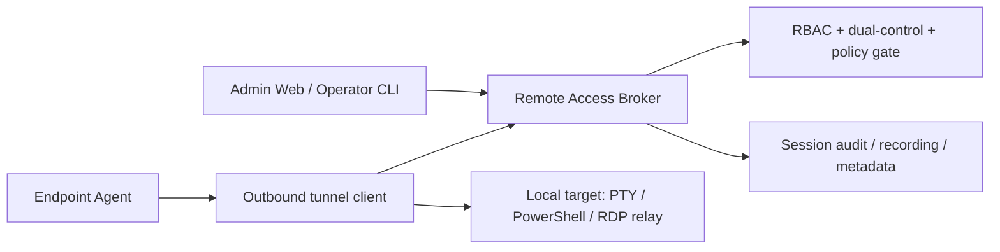

# Faz 22.6 - Remote Access Bridge

> **Status**: PLANNING / BLOCKED by Sensitive Endpoint Ops Governance Gate.
> **Created**: 2026-06-09
> **Board / issue authority**:
> - platform-k8s-gitops [#1388](https://github.com/Halildeu/platform-k8s-gitops/issues/1388) - sensitive endpoint ops governance gate
> - platform-k8s-gitops [#1389](https://github.com/Halildeu/platform-k8s-gitops/issues/1389) - phase boundary sync
> - platform-k8s-gitops [#1400](https://github.com/Halildeu/platform-k8s-gitops/issues/1400) - OSS-only build-vs-buy decision matrix
> - platform-k8s-gitops [#1401](https://github.com/Halildeu/platform-k8s-gitops/issues/1401) - MeshCentral/RustDesk transport adapter POC boundary
> - platform-k8s-gitops [#1402](https://github.com/Halildeu/platform-k8s-gitops/issues/1402) - endpoint-admin broker ADR / state machine
> - platform-backend [#510](https://github.com/Halildeu/platform-backend/issues/510) - remote-access bridge umbrella
> - platform-backend [#524](https://github.com/Halildeu/platform-backend/issues/524) - broker ADR + state machine
> - platform-agent [#116](https://github.com/Halildeu/platform-agent/issues/116) - agent outbound tunnel client spike

Bu doküman, managed endpoint'lere uzaktan destek ve test için **agent-initiated
outbound remote-access bridge** hattını tanımlar. Faz 22.6, Faz 22.5 yazılım
yönetimi komut kuyruğunun yerine geçmez; uzun ömürlü, interaktif ve yüksek
yetkili destek oturumları için ayrı bir güvenlik modeli üretir.

> **Karar kaydı:** Broker mimarisi, OpenFGA `remote_session` authz, token
> kontratı, audit/recording şeması, #1388 minimum pilot seti, KVKK ve threat
> model [`ADR-0033`](./adr/0033-faz-22-6-remote-access-bridge-broker.md)'te
> (3-AI consensus: Codex `019ea9aa` + Mavis/MiniMax `mvs_c922…` + Claude,
> 2026-06-09). Aşağıdaki §4 "Hedef Mimari" üst-seviye kalır; detaylı state
> machine/token/audit ADR-0033'tedir. Owner-decision checklist: §9.

## 1. Amaç

- IT / operator'ın dış ağdaki veya domain'e anlık erişimi olmayan Windows
  endpoint'e güvenli destek oturumu açabilmesi.
- Endpoint tarafında inbound port açmadan, agent'ın dışarı doğru kurduğu
  kontrollü kanal üzerinden erişim sağlanması.
- Geliştirme ve pilot testlerinde uzak cihaz doğrulamasını hızlandırmak, fakat
  bunu üretim güvenlik modelinden koparmamak.

## 2. Faz Sınırı

| Kapsam | Faz | Karar |
|---|---:|---|
| WinGet install/uninstall, catalog, compliance, diagnostics | 22.5 | Mevcut software deployment / managed lifecycle hattı |
| Persistent reverse tunnel, broker, session authorization | 22.6 | Bu dokümanın kapsamı |
| Scheduled backup, offboarding copy, forensic collection | 22.8 | Ayrı Endpoint Data Protection hattı |
| Compliance Gap Mart aggregate reporting | 22.7 | Zaten platform-backend #376 tarafından sahiplenildi |

### 2.1 OSS-only Build-vs-Buy Kararı

Faz 22.6 için karar, "remote access ürününü alıp platformun yerine koymak"
değildir. Endpoint-admin **broker / policy / approval / audit** katmanını
kendi üretir; açık kaynak araçlar yalnız transport/relay adayı olabilir.

| Araç / yaklaşım | Karar | Gerekçe | Takip |
|---|---|---|---|
| Endpoint-admin broker | **BUILD CORE** | #1388 dual-control, RBAC, audit/recording, retention, TTL ve abort semantics platform-native olmalı | #1402 |
| MeshCentral | **ADAPT / primary transport POC** | Agent/relay ve no-inbound model güçlü; fakat authz/audit/approval sahibi olamaz | #1401 |
| RustDesk OSS server/client | **SECONDARY POC / defer** | Relay modeli faydalı olabilir; AGPL/distribution ve paid/pro feature boundary daha sıkı review ister | #1401 |
| Apache Guacamole | **REJECT primary path** | Agentless gateway çoğu senaryoda RDP/VNC/SSH reachability gerektirir; outbound endpoint-agent modeliyle zayıf uyumlu | #1400 |
| Remotely | **REJECT / low priority** | Remote scripting/control yüzeyi bizim control plane ile çakışır; GPL ve uyum riski MeshCentral'dan yüksek | #1400 |

Bu karar runtime yetkisi vermez. #1388 kabul edilmeden relay POC bile yalnız
offline/lab design seviyesinde kalır; canlı remote session açılmaz.

## 3. Non-goals

- Agent command polling hattını gRPC-streaming benzeri tek kanala dönüştürmek.
- Raw shell / arbitrary PowerShell execution'ı Faz 22.5 komut modeli içine
  sızdırmak.
- Dosya yedekleme, kullanıcı klasörü kopyalama veya forensic image alma.
- IT onayı, KVKK/legal basis, RBAC ve audit olmadan unattended erişim açmak.
- VPN yerine domain authentication çözmek. Domain password/cache/pre-logon
  senaryoları ayrı IT/domain runbook'larıyla değerlendirilir.

## 4. Hedef Mimari

Ana prensip: endpoint tarafı **outbound-only** bağlanır. Broker, session
kimliği, TTL, actor, approval, target device ve allowed capability set'i üretir.
Agent yalnız kendisine atanmış kısa ömürlü session token ile bridge açar.

## 5. Milestone Planı

| Milestone | Kapsam | Acceptance |
|---|---|---|
| **22.6.0 Governance gate** | #1388 kararları: legal basis, RBAC, dual-control, audit, retention, redaction | Gate issue kabul edilmeden hiçbir runtime erişim açılmaz |
| **22.6.1 Broker ADR** | Session state machine, authz model, TTL, abort semantics, audit schema | #524 ADR + test fixture + negative authorization cases |
| **22.6.2 Agent tunnel spike** | Outbound-only client, reconnect/backoff, capability advertisement | #116 spike; inbound port yok; disabled-by-default |
| **22.6.3 PTY / command MVP** | Kontrollü support shell veya constrained PTY | Explicit allowlist + full audit + session recording policy |
| **22.6.4 Attended / unattended policy** | User consent prompt, unattended exception policy, break-glass | Owner-approved policy; dual-control enforced |
| **22.6.5 Web/ops surface** | Session request, approve, join, terminate, evidence view | Browser smoke + audit evidence |
| **22.6.6 Pilot** | 2-5 cihaz live pilot | D29: Up + Functional + Secured ayrı kanıtlanır |

## 6. Güvenlik Kapıları

- #1388 sensitive endpoint ops governance gate accepted olmadan runtime yok.
- Session token kısa ömürlü olur; reusable admin credential agent'a verilmez.
- Unattended erişim ayrı policy ister; default attended / explicit approval.
- Same-user self-approval yok; destructive veya sensitive capability dual-control.
- Tüm oturumlarda actor, approver, device, start/end time, capability set,
  command/session metadata ve abort reason auditlenir.
- Session recording / transcript saklama, retention ve erişim politikası KVKK
  ile uyumlu tanımlanır.
- Agent tarafında capability false-advertising guard gerekir: disabled feature
  broker'a açık görünmez.

## 7. D29 Acceptance Model

| Katman | Kanıt |
|---|---|
| **Up** | Broker pod/endpoint reachable; agent tunnel client can connect with disabled-by-default config |
| **Functional** | Authorized session request creates a bounded tunnel; unauthorized request denied; TTL/abort works |
| **Secured** | RBAC + dual-control + audit + retention policy enforce edilir; session token replay/fake-device cases fail closed |

Tek kelimelik "çalışıyor" kabul edilmez. 22.6 runtime claim için bu üç
katman ayrı kanıtlanır.

## 8. Board Mapping

| Issue | Rol | Status yorumu |
|---|---|---|
| gitops #1388 | Sensitive Endpoint Ops Governance Gate | BLOCKED/P0; 22.6 ve 22.8 runtime ön koşulu |
| gitops #1389 | Phase boundary sync | Docs/board truth düzeltme |
| gitops #1400 | OSS-only build-vs-buy decision matrix | Cross-phase karar otoritesi; runtime yetkisi vermez |
| gitops #1401 | MeshCentral/RustDesk transport adapter POC boundary | Todo/P1; transport-only değerlendirme |
| gitops #1402 | Remote Access Broker ADR / state machine | Todo/P0; broker/policy/audit core kontratı |
| backend #510 | 22.6 umbrella | BLOCKED by #1388 |
| backend #524 | Broker ADR/state machine | BLOCKED by #1388/#510 |
| agent #116 | Agent outbound tunnel spike | BLOCKED by #1388/#524 |

## 9. 3-AI Consensus + #1388 Owner-Decision Checklist (2026-06-09)

3 sağlayıcı (Codex/OpenAI `019ea9aa` + Mavis/MiniMax `mvs_c922…` + Claude/Anthropic) bağımsız mutabakat: build-vs-buy **hybrid**, `pilot_ready_after_owner_decision: **no**`. Tam karar kaydı [ADR-0033](./adr/0033-faz-22-6-remote-access-bridge-broker.md).

### 9.1 Agent-actionable ŞİMDİ (runtime açmadan — paralel ilerler)

- [x] ADR-0033 broker mimarisi + authz + token + audit + threat model + KVKK (bu PR)
- [ ] `#1402`/`#524` broker skeleton: state-machine + OpenFGA `remote_session` + token contract + audit schema, **`ENABLE_REMOTE_SUPPORT=false`** disabled-by-default, tests only
- [ ] OSS matris refinement (#1400/#1401): OpenZiti/zrok + Guacamole-as-adapter + per-tool bypass-risk
- [ ] Negative-test plan: self-approval deny · expired/replayed token deny · capability-mismatch deny · recorder-unavailable deny (fail-closed)
- [ ] Synthetic loopback tunnel spike (#116) — **lab/synthetic only**; managed endpoint'e bağlanmak runtime sayılır

### 9.2 Owner / legal decision checklist (#1388 — runtime'ı açan kapı, sensiz ilerleyemez)

Aşağıdakiler kabul edilip #1388'de imzalanmadan **hiçbir canlı session açılmaz**:

- [ ] **Legal basis (KVKK)**: meşru menfaat / sözleşme / hukuki yükümlülük + aydınlatma metni; employee consent tek başına yetersiz (güç asimetrisi). İK + Hukuk imzalı policy + employee acknowledgment.
- [ ] **KVKK kapsam**: m.5 işleme şartı (legal basis) + m.10 aydınlatma + m.12 veri güvenliği — session recording = kişisel veri işleme kabulü; m.6 yalnız özel-nitelikli veri varsa, m.9 yalnız sınır-ötesi aktarım varsa; ADR-0030 encryption + RBAC + access-audit reuse.
- [ ] **Recording retention/access**: metadata 7y / raw 30-90g encrypted / sadece IT-Security-lead + Data-Controller + incident-responder; segment-erişim audit'i.
- [ ] **Attended/unattended + break-glass policy**: pilot **attended-only**; unattended/break-glass Phase 2 (ayrı ADR).
- [ ] **Named pilot scope**: 2-5 IT-owned cihaz + named requester/operator/approver listesi.
- [ ] **Capability sınıfları**: pilot için izinli set (öneri: view-only veya allowlist'li PTY; file-transfer/clipboard/elevation OFF).
- [ ] **3rd-party OSS/relay DPA**: OpenZiti/zrok/MeshCentral subprocessor/DPA duruşu.

### 9.3 Pipeline

`#1388 owner/legal accept` → `ADR-0033 ACCEPTED` → OSS seçimi → broker impl + negative-test evidence → recording fail-closed evidence → **ilk attended pilot (D29-EA Up/Functional/Secured ayrı kanıt)**.
