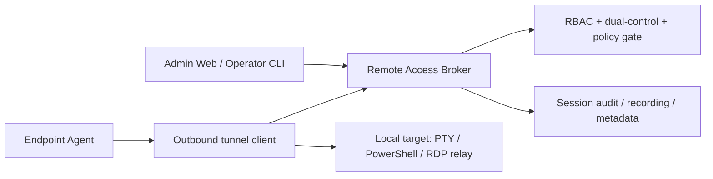

# Faz 22.6 - Remote Access Bridge

> **Status**: PLANNING / BLOCKED by Sensitive Endpoint Ops Governance Gate.
> **Created**: 2026-06-09
> **Board / issue authority**:
> - platform-k8s-gitops [#1388](https://github.com/Halildeu/platform-k8s-gitops/issues/1388) - sensitive endpoint ops governance gate
> - platform-k8s-gitops [#1389](https://github.com/Halildeu/platform-k8s-gitops/issues/1389) - phase boundary sync
> - platform-backend [#510](https://github.com/Halildeu/platform-backend/issues/510) - remote-access bridge umbrella
> - platform-backend [#524](https://github.com/Halildeu/platform-backend/issues/524) - broker ADR + state machine
> - platform-agent [#116](https://github.com/Halildeu/platform-agent/issues/116) - agent outbound tunnel client spike

Bu doküman, managed endpoint'lere uzaktan destek ve test için **agent-initiated
outbound remote-access bridge** hattını tanımlar. Faz 22.6, Faz 22.5 yazılım
yönetimi komut kuyruğunun yerine geçmez; uzun ömürlü, interaktif ve yüksek
yetkili destek oturumları için ayrı bir güvenlik modeli üretir.

## 1. Amaç

- IT / operator'ın dış ağdaki veya domain'e anlık erişimi olmayan Windows
  endpoint'e güvenli destek oturumu açabilmesi.
- Endpoint tarafında inbound port açmadan, agent'ın dışarı doğru kurduğu
  kontrollü kanal üzerinden erişim sağlanması.
- Geliştirme ve pilot testlerinde uzak cihaz doğrulamasını hızlandırmak, fakat
  bunu üretim güvenlik modelinden koparmamak.

## 2. Faz Sınırı

| Kapsam | Faz | Karar |
|---|---:|---|
| WinGet install/uninstall, catalog, compliance, diagnostics | 22.5 | Mevcut software deployment / managed lifecycle hattı |
| Persistent reverse tunnel, broker, session authorization | 22.6 | Bu dokümanın kapsamı |
| Scheduled backup, offboarding copy, forensic collection | 22.8 | Ayrı Endpoint Data Protection hattı |
| Compliance Gap Mart aggregate reporting | 22.7 | Zaten platform-backend #376 tarafından sahiplenildi |

## 3. Non-goals

- Agent command polling hattını gRPC-streaming benzeri tek kanala dönüştürmek.
- Raw shell / arbitrary PowerShell execution'ı Faz 22.5 komut modeli içine
  sızdırmak.
- Dosya yedekleme, kullanıcı klasörü kopyalama veya forensic image alma.
- IT onayı, KVKK/legal basis, RBAC ve audit olmadan unattended erişim açmak.
- VPN yerine domain authentication çözmek. Domain password/cache/pre-logon
  senaryoları ayrı IT/domain runbook'larıyla değerlendirilir.

## 4. Hedef Mimari

Ana prensip: endpoint tarafı **outbound-only** bağlanır. Broker, session
kimliği, TTL, actor, approval, target device ve allowed capability set'i üretir.
Agent yalnız kendisine atanmış kısa ömürlü session token ile bridge açar.

## 5. Milestone Planı

| Milestone | Kapsam | Acceptance |
|---|---|---|
| **22.6.0 Governance gate** | #1388 kararları: legal basis, RBAC, dual-control, audit, retention, redaction | Gate issue kabul edilmeden hiçbir runtime erişim açılmaz |
| **22.6.1 Broker ADR** | Session state machine, authz model, TTL, abort semantics, audit schema | #524 ADR + test fixture + negative authorization cases |
| **22.6.2 Agent tunnel spike** | Outbound-only client, reconnect/backoff, capability advertisement | #116 spike; inbound port yok; disabled-by-default |
| **22.6.3 PTY / command MVP** | Kontrollü support shell veya constrained PTY | Explicit allowlist + full audit + session recording policy |
| **22.6.4 Attended / unattended policy** | User consent prompt, unattended exception policy, break-glass | Owner-approved policy; dual-control enforced |
| **22.6.5 Web/ops surface** | Session request, approve, join, terminate, evidence view | Browser smoke + audit evidence |
| **22.6.6 Pilot** | 2-5 cihaz live pilot | D29: Up + Functional + Secured ayrı kanıtlanır |

## 6. Güvenlik Kapıları

- #1388 sensitive endpoint ops governance gate accepted olmadan runtime yok.
- Session token kısa ömürlü olur; reusable admin credential agent'a verilmez.
- Unattended erişim ayrı policy ister; default attended / explicit approval.
- Same-user self-approval yok; destructive veya sensitive capability dual-control.
- Tüm oturumlarda actor, approver, device, start/end time, capability set,
  command/session metadata ve abort reason auditlenir.
- Session recording / transcript saklama, retention ve erişim politikası KVKK
  ile uyumlu tanımlanır.
- Agent tarafında capability false-advertising guard gerekir: disabled feature
  broker'a açık görünmez.

## 7. D29 Acceptance Model

| Katman | Kanıt |
|---|---|
| **Up** | Broker pod/endpoint reachable; agent tunnel client can connect with disabled-by-default config |
| **Functional** | Authorized session request creates a bounded tunnel; unauthorized request denied; TTL/abort works |
| **Secured** | RBAC + dual-control + audit + retention policy enforce edilir; session token replay/fake-device cases fail closed |

Tek kelimelik "çalışıyor" kabul edilmez. 22.6 runtime claim için bu üç
katman ayrı kanıtlanır.

## 8. Board Mapping

| Issue | Rol | Status yorumu |
|---|---|---|
| gitops #1388 | Sensitive Endpoint Ops Governance Gate | BLOCKED/P0; 22.6 ve 22.8 runtime ön koşulu |
| gitops #1389 | Phase boundary sync | Docs/board truth düzeltme |
| backend #510 | 22.6 umbrella | BLOCKED by #1388 |
| backend #524 | Broker ADR/state machine | BLOCKED by #1388/#510 |
| agent #116 | Agent outbound tunnel spike | BLOCKED by #1388/#524 |
