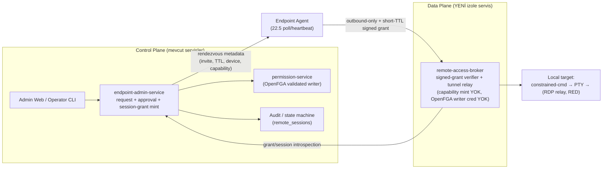

# Faz 22.6 — Remote Access Bridge

> **Status**: PLANNING / BLOCKED — iki kapı birden:
> 1. **Sensitive Endpoint Ops Governance Gate** ([gitops #1388](https://github.com/Halildeu/platform-k8s-gitops/issues/1388))
> 2. **Governance Drift Reconciliation** (§0, P0 — bu revizyonda keşfedildi)
>
> **Created**: 2026-06-09 · **System-fit revision**: 2026-06-09
> **Cross-AI consensus**: Implementer **Claude (Opus 4.8)** / Reviewer **Codex (OpenAI)** — thread `019ea961-561d-73a3-acf8-ad9f02a317b6`, verdict **REVISE → AGREE** (2 tur).
> **Board / issue authority**:
> - platform-k8s-gitops [#1388](https://github.com/Halildeu/platform-k8s-gitops/issues/1388) — sensitive endpoint ops governance gate
> - platform-k8s-gitops [#1389](https://github.com/Halildeu/platform-k8s-gitops/issues/1389) — phase boundary sync
> - platform-backend [#510](https://github.com/Halildeu/platform-backend/issues/510) — remote-access bridge umbrella
> - platform-backend [#524](https://github.com/Halildeu/platform-backend/issues/524) — broker ADR + state machine
> - platform-agent [#116](https://github.com/Halildeu/platform-agent/issues/116) — agent outbound tunnel client spike
> - platform-k8s-gitops [#1400](https://github.com/Halildeu/platform-k8s-gitops/issues/1400) — OSS-only build-vs-buy decision matrix
> - platform-k8s-gitops [#1401](https://github.com/Halildeu/platform-k8s-gitops/issues/1401) — MeshCentral/RustDesk transport adapter POC boundary
> - platform-k8s-gitops [#1402](https://github.com/Halildeu/platform-k8s-gitops/issues/1402) — endpoint-admin broker ADR / state machine
> - **YENİ**: governance-drift reconciliation item (ADR-0012-EA ladder/guard uyumlama) — #1388 altında ayrı slice

Bu doküman, managed endpoint'lere uzaktan destek ve test için **agent-initiated
outbound remote-access bridge** hattını tanımlar. Faz 22.6, Faz 22.5 yazılım
yönetimi komut kuyruğunun yerine geçmez; uzun ömürlü, interaktif ve yüksek
yetkili destek oturumları için **ayrı bir güvenlik modeli** üretir.

> **Bu revizyonun amacı (sistem uyumu):** İlk taslak "remote support feature planı"
> seviyesindeydi. Bu revizyon onu platformun mevcut governance modeline
> (ADR-0012-EA, D29-EA 7×3 matris, D35-EA destructive ladder, G7 izolasyon,
> DD-EA guard'ları, PLAN.md D10/D21/D29 mühürleri, KVKK envanteri) **bağlı,
> high-blast-radius capability planına** dönüştürür.

---

## §0 — Governance Drift Reconciliation (P0 Önkoşul, YENİ)

> **Bu doküman merge edilebilir** (drift'i açık blocker olarak taşıyan plan-time
> artifact). Ama **22.6 runtime'ı bu drift kapatılmadan başlayamaz**: broker
> deploy, edge route, agent tunnel enable, session token mint, pilot veya UI
> enablement YASAK.

Sistem uyumu incelemesi sırasında, repo'da **iki ayrı governance modeli** olduğu
tespit ve doğrulandı:

| Öğe | Canonical ADR dosyası `docs/adr/0012-EA-endpoint-admin-governance-charter.md` | Mutabakat raporu `docs/2026-04-29-endpoint-admin-service-uyum-mutabakati.md` |
|---|---|---|
| **D35-EA merdiveni** | **Düz 0..5** (arbitrary-exec / interactive-session sınıfı YOK) | 6-kademe, **D35-EA-4-A..E** alt-sınıflı + D35-EA-5 pilot |
| **D35-EA-4** | Service control (start/stop/restart) | Bounded remediation / uninstall / tamper / pw-reset / **arbitrary (4-A..4-E)** |
| **D35-EA-5** | Destructive (uninstall/format/pw-reset) | Pilot Endpoint Functional (IT-owned VM) |
| **DD-EA-4** | cosign verify on deploy | HMAC key version sync |
| **DD-EA-6** | Destructive command audit log (immutable) | Go route-authz metadata guard |
| **DD-EA-7** | Identity discovery PII boundary | Update Channel Governance (TUF-analog) |

**Sonuç:** Canonical ADR'de **arbitrary-exec / interactive-session tier'ı yok**.
22.6 (interaktif remote shell/PTY/RDP), mevcut canonical ADR'ye doğrudan
bağlanamaz — bağlanırsa "remote session = destructive (D35-EA-5)" gibi **fazla
kaba ve güvenlik açısından yetersiz** bir sınıflama doğar.

### §0.1 — Binding kararı (cross-AI mutabakatı)

- 22.6 için gerekli model: **extended D35-EA ladder** = 2026-04-29 mutabakat
  raporundaki 4-A..4-E modeli **+ 4-F genişletmesi** (bkz. §5).
- Canonical ADR-0012-EA henüz bunu taşımadığı için bu binding **proposed /
  planning-only** statüdedir.
- **Runtime implementation, pilot, broker deploy veya agent tunnel enablement,
  ADR-0012-EA canonical reconciliation olmadan YASAKTIR.**
- **ADR migration bu doküman içinde yapılmaz**: bu doküman yalnız önkoşulu ve
  hedef extended modeli tarif eder; canonical değişiklik **ayrı
  governance-migration item** + #1388 altında yapılır (HARD RULE — Governance /
  Sistemik Bug: önce governance migration, sonra feature).

---

## §1 — Amaç

- IT / operator'ın dış ağdaki veya domain'e anlık erişimi olmayan Windows
  endpoint'e güvenli destek oturumu açabilmesi.
- Endpoint tarafında **inbound port açmadan**, agent'ın dışarı doğru kurduğu
  kontrollü kanal üzerinden erişim sağlanması.
- Geliştirme ve pilot testlerinde uzak cihaz doğrulamasını hızlandırmak, fakat
  bunu üretim güvenlik modelinden koparmamak.

## §2 — Faz Sınırı

| Kapsam | Faz | Karar |
|---|---:|---|
| WinGet install/uninstall, catalog, compliance, diagnostics | 22.5 | Mevcut software deployment / managed lifecycle hattı |
| Persistent reverse tunnel, broker, session authorization | 22.6 | Bu dokümanın kapsamı |
| Scheduled backup, offboarding copy, forensic collection | 22.8 | Ayrı Endpoint Data Protection hattı |
| Compliance Gap Mart aggregate reporting | 22.7 | Zaten platform-backend #376 tarafından sahiplenildi (LIVE testai) |

## §3 — Non-goals (genişletilmiş)

- Agent command polling hattını (22.5) gRPC-streaming benzeri tek kanala
  dönüştürmek. **22.6 poll plane'i replace etmez**; rendezvous sinyali için
  kullanabilir (§4).
- Raw shell / arbitrary PowerShell execution'ı Faz 22.5 komut modeli içine
  sızdırmak.
- Dosya yedekleme, kullanıcı klasörü kopyalama veya forensic image alma (22.8).
- IT onayı, KVKK/legal basis, RBAC ve audit olmadan unattended erişim açmak.
- VPN yerine domain authentication çözmek.
- **DEFAULT RED (açıkça yasak, ayrı capability + dual-control olmadan açılmaz):**
  clipboard redirect, drive/printer redirection, file transfer, RDP enablement
  state-mutation, **unattended-without-break-glass**, gerçek kullanıcı
  credential capture, gizli arka-plan kontrolü.

## §4 — Hedef Mimari: Control-Plane / Data-Plane Ayrımı

> **En büyük güvenlik gerçeği:** 22.6, internetten erişilebilir bir broker
> üzerinden ayrıcalıklı endpoint agent'larına **canlı C2 / data-plane** açar.
> **Broker compromise = fleet remote-control attempt.** Bu yüzden mimari,
> control-plane ile data-plane'i ayırır; broker tek başına capability mint
> **edemez**.

**Rendezvous semantiği (Codex precision):** Agent session grant'i *önceden
bilmez*. Akış:
1. Control plane (endpoint-admin-service) approved session grant üretir
   (dual-control sonrası).
2. Agent, mevcut **22.5 poll/heartbeat** üzerinden **session invite / rendezvous
   metadata** alır (TTL, device binding, capability tier, recording-required
   flag). → Poll plane *replace* edilmez, yalnız rendezvous sinyali için kullanılır.
3. Agent broker'a **outbound-only** bağlanır, short-TTL signed grant sunar.
4. Broker, signed grant / session state'i **control-plane introspection
   endpoint'inden** doğrular (broker'ın OpenFGA'ya doğrudan erişimi YOK — §6).

**Ana prensip:** endpoint tarafı outbound-only; broker session kimliği, TTL,
actor, approval, target device ve allowed capability set'i kendisi üretmez;
yalnız doğrular ve relay eder.

## §5 — System-Fit / Governance Binding: D35-EA tier table + DD-EA-8 (YENİ)

22.6 her capability'sini **extended D35-EA ladder**'a (proposed, §0) bağlar:

| 22.6 Capability | Tier | Gate |
|---|---|---|
| **Constrained-command-allowlist** | **D35-EA-4-E** (controlled sub-mode) | Her komut ayrı policy/authz/audit/approval objesi; per-command allowlist; **command transcript + stdout/stderr redaction + hash-chain** |
| **Full PTY / interactive PowerShell** | **D35-EA-4-F-PTY** (YENİ) | DEFAULT RED; attended by default; M-of-N; cooldown; max-duration; **session recording mandatory**; default no file transfer |
| **Screen view / control / RDP relay** | **D35-EA-4-F-REMOTE-CONTROL** (YENİ) | PTY'den daha sıkı; last / RED; clipboard/drive/printer redirection ayrı RED capability |
| **Unattended access** | **D35-EA-4-F break-glass alt-modu** | Pilotta KAPALI; explicit break-glass policy objesi + M-of-N + post-action audit |

- **BG-EA-1 checkbox seti güncellenir:** mevcut guard listesi "arbitrary command
  exec"e kadar gidiyor; **remote-session / screen-control / file-transfer /
  clipboard / unattended** sınıfları eklenir.
- **YENİ guard — DD-EA-8 Remote Session Governance Guard** (CI gate, DD-EA-7
  update-channel guard'ının analoğu):
  - session capability **onaylı bir D35-EA tier'ına map etmek zorunda**;
  - 4-F için `recording-required` flag enforce;
  - `unattended` ancak break-glass policy objesi varsa;
  - **disabled feature broker'a advertise edilemez** (AG-013 capability
    false-advertising precedent'i).

## §5b — OSS-only Transport Adapter Kararı (PR #1395 absorb)

> 22.6 kararı "hazır bir remote-control aracını alıp çalıştırmak" **değildir**.
> **Authz / audit / approval / session-grant / chain-of-custody control-plane'de
> kalır** (endpoint-admin + broker, §4); OSS araçlar yalnız **transport adapter /
> relay** rolü alabilir — kendi başına authz/audit sahibi **olamaz**.

| Araç | Karar | Sistem-fit notu |
|---|---|---|
| **MeshCentral** | **ADAPT / primary transport POC** | Agent/relay + no-inbound modeli §4 control/data-plane ayrımına uygun; **broker grant-verifier kalır, MeshCentral relay olur**; authz/audit/approval **sahibi olamaz** (#1401) |
| RustDesk OSS | **SECONDARY POC / defer** | Relay faydalı olabilir; AGPL/distribution + paid/pro feature boundary daha sıkı review (#1401) |
| Apache Guacamole | **REJECT primary** | Agentless gateway RDP/VNC/SSH reachability ister; outbound endpoint-agent modeliyle zayıf uyumlu (#1400) |
| Remotely | **REJECT / low priority** | Remote scripting yüzeyi control-plane ile çakışır; GPL/uyum riski (#1400) |

> Transport adapter seçimi **DD-EA-8 + D35-EA-4-F tier binding'ini değiştirmez**;
> hangi OSS relay kullanılırsa kullanılsın session grant/recording/dual-control
> control-plane'de enforce edilir (broker ADR [ADR-0033](adr/0033-faz226-remote-access-broker.md)).

## §6 — G7 Operational Isolation: Broker İzolasyonu (YENİ)

**G7 ingress inversion (top platform-fit risk):** Mevcut G7 egress modeli
(charter §5.8) "egress allowlist: backend ↔ DB ↔ OpenFGA ↔ Vault; dış internet
yalnız update channel" der — endpoint servisleri için **internet-facing ingress
YOK**. Agent'lar outbound-only olduğundan broker'ı **dial ederler** → broker
**internet-reachable edge-terminated ingress** olmak zorunda. Bu, mevcut G7
modelinin öngörmediği yeni bir saldırı yüzeyidir.

**Broker = YENİ izole servis (`remote-access-broker`):**
- Ayrı **ServiceAccount + RBAC** (least-priv).
- Ayrı **NetworkPolicy**:
  - **ingress: yalnız edge'den** (host-nginx / ingress passthrough); kaynak-IP +
    pod source-identity'nin nasıl görüleceği açıkça yazılır.
  - **egress: control-plane session-introspection endpoint + audit + Vault** —
    **doğrudan OpenFGA'ya egress YOK**. Broker OpenFGA writer credential
    taşımaz; authz check'i control-plane introspection üzerinden alır (blast
    radius minimizasyonu, Codex precision).
- Ayrı **ResourceQuota** (explicit; HPA yok — §10/§12, PLAN.md D21).
- Ayrı **ExternalSecret path** `kv/platform/remote-access-broker/*`.
- Ayrı **DB role** (least-priv; `remote_sessions` state machine'e bağlı).
- Ayrı **ArgoCD application** boundary.
- **Edge mTLS / session-token termination kontratı** (bkz. §10, #1359 bağımlılığı).

## §6b — Session Authz Modeli

> Tüm ephemeral session state'i OpenFGA tuple churn'üne çevirmek shared store
> için risklidir. Hibrit model:

- **DB `remote_sessions` state machine = canonical:**
  `REQUESTED → APPROVED → TOKEN_ISSUED → CONNECTED → CONTROL_GRANTED →
  ENDED / ABORTED`.
- **OpenFGA = yalnız statik perm'ler** (device / tenant / admin / capability) +
  gerektiğinde session-level relation check.
- **permission-service validated-writer path korunur**: broker ve
  endpoint-admin **doğrudan OpenFGA write yapmaz** (DD-EA-2 / charter writer
  discipline).
- Her state transition **imzalı audit event** üretir: `actor ≠ approver`, tenant
  anchor (`OUR_COMPANY:<tenant_id>` literal), device binding, capability tier,
  `recording-required` flag.

## §7 — Milestone Planı (revize)

| Milestone | Kapsam | Acceptance |
|---|---|---|
| **22.6.0 Governance gate + drift reconciliation** | #1388 kararları + §0 ADR-0012-EA extended-ladder reconciliation (ayrı migration item) | Gate kabul + drift kapatılmadan hiçbir runtime erişim açılmaz |
| **22.6.1 Broker ADR + state machine** | #524: transport (WS/gRPC), session state machine, TTL, abort, dual-control, audit schema | Codex plan-time adversarial iter + test fixture + negative-authz cases |
| **22.6.2 Agent outbound tunnel spike** | #116: outbound-only client, reconnect/backoff, capability advertisement, **disabled-by-default**, false-advertising guard | inbound port yok; capability advertise guard testi |
| **22.6.3 Constrained-command MVP (4-E sub-mode)** | Per-command allowlist + transcript + stdout/stderr redaction + hash-chain | Explicit allowlist + full audit + tier-binding |
| **22.6.4 Full PTY (4-F-PTY)** | attended + M-of-N + cooldown + max-duration + **recording mandatory** | Recording + dual-control + abort enforce |
| **22.6.5 Web / ops surface** | Session request, approve, join, terminate, evidence view | Browser smoke + audit evidence |
| **22.6.6 Tier-restricted pilot (D35-EA-5)** | **IT-owned domain-joined VM**, recording mandatory, **unattended OFF** | D29: Up + Functional + Secured ayrı kanıt + G8 KVKK gate (§11) |
| **22.6.X RDP relay (4-F-REMOTE-CONTROL)** | Ekran kontrol + redirection sınıfları | **Deferred / RED**; ayrı capability + storage gate (§9) sonrası |

## §8 — Güvenlik Kapıları (revize)

- #1388 sensitive endpoint ops governance gate **accepted** + §0 drift
  reconciliation tamam olmadan runtime YOK.
- Session token **kısa ömürlü**; reusable admin credential agent'a verilmez.
- Default **attended / explicit approval**; same-user self-approval YOK;
  destructive/sensitive capability **dual-control**.
- **Cihaz başına tek aktif session** (parallel joiner yalnız explicit relation ile).
- **DD-EA-8 CI gate** (§5) + **D35-EA-4-F live-evidence gate**:
  - stale-token reject;
  - same-user-approval reject;
  - tenant-mismatch reject;
  - disabled-capability-not-advertised;
  - no-recording-session deny (4-F);
  - no-cert-edge reject;
  - orphan-session cleanup;
  - duration timeout;
  - **active session yalnız TTL içinde + aynı device binding ile
    survive/reconnect eder** (reconnect semantics yoksa stale control / duplicate
    session riski).
- Agent tarafında capability false-advertising guard: disabled feature broker'a
  açık görünmez.

## §9 — Evidence Storage (unified, bounded — 22.8 ile contract paylaşımı)

- 22.6, **`evidence-storage-contract v0`**'ı **22.8 ile paylaşarak tüketir**
  (object storage + ACL + encryption + hash manifest + access audit + retention).
  Ayrı storage tasarımı çıkarmak KVKK / retention / immutability / chain-of-custody'yi
  ikiye böler.
- **Faz sınırı korunur:** 22.6 yalnız contract'ı **tüketir**; 22.8'in file
  backup / forensic collection **pipeline'ını uygulamaz**.
- **Constrained-command modu (4-E):** append-only **command transcript +
  stdout/stderr redaction + audit hash-chain** (BE-016 hash-chain pattern)
  yeterli olabilir — "recording" değil, "transcript".
- **Full PTY / RDP (4-F):** **session recording mandatory** → object storage +
  encryption + retention + hash manifest + access audit + **capacity gate**
  açılmadan enable edilemez.

## §10 — Bağımlılıklar

- **#1359 edge mTLS / DNS = NECESSARY-BUT-NOT-SUFFICIENT.** ADR-0029 zaten mTLS
  self-enroll + `endpoint-agent-mtls.testai.acik.com` + ingress mTLS
  termination/passthrough + no-cert negative test gerektirir. 22.6 broker edge'i
  aynı kabiliyete bağlıdır; M2 (#1359) bu kabiliyette bloklu. **Ancak**: #1359
  domain-joined / AD CS SAN identity path'i içindir; **22.2.A workgroup / BYOD /
  non-domain cihazlar için AD CS SAN identity yok** → non-domain için ayrı
  **device-cert issuance/rotation** veya **bearer-derived → cert-bound session**
  kontratı gerekir. "Edge mTLS hazırsa her endpoint sınıfı hazır" DENMEZ.
- **Agent concurrency kontratı:** 22.5 poll loop + 22.6 tunnel aynı anda çalışır
  → command queue starvation, uninstall/remote-session lock conflict, heartbeat
  timeout, reconnect semantics açıkça tanımlanır.

## §11 — D29 Kabul + G8 Privacy/Legal Gate

D29 üç katmanı **değişmez** (PLAN.md D29 mühürü — "4. pillar" YASAK):

| Katman | Kanıt |
|---|---|
| **Up** | Broker pod/endpoint reachable; agent tunnel client disabled-by-default config ile bağlanabiliyor |
| **Functional** | Authorized session request bounded tunnel kurar; unauthorized request denied; TTL/abort çalışır |
| **Secured** | RBAC + dual-control + audit + retention enforce; token replay / fake-device fail-closed |

**+ Ayrı P0 kapı — G8 Privacy/Legal (D29'un 4. katmanı DEĞİL, ayrı boyut):**
- DPO / legal basis. **Default candidate: KVKK m.5/2-f (meşru menfaat)** — ancak
  bu **DPO/Hukuk tarafından onaylanacak**; gerektiğinde açık rıza / iş sözleşmesi /
  hukuki yükümlülük ayrımı yapılır. Tek maddeye erken mühürlenmez.
- Endpoint-side **attended consent UI** + session recording notice + **operator
  identity display** + **local abort button**.
- Retention schedule + access audit; `docs/22-2-kvkk-data-inventory.md` (DRAFT,
  DPO review required) + **BE-019** enforcement gate ile bağlanır.
- **Teams notification = audit-adjacent only**, approval evidence DEĞİL.

## §12 — Sistem-Fit Risk Register

| Risk | Not |
|---|---|
| **Broker compromise = fleet C2** | Control/data-plane ayrımı + broker capability-mint-edemez + OpenFGA writer yok (§4/§6) |
| **G7 ingress inversion** | Internet-facing broker ingress; izole servis + NetPol ingress-from-edge-only (§6) |
| **Capacity / no-HPA** | Long-lived WS/TCP, fd limits, broker max-sessions, ResourceQuota; PLAN.md D21 HPA disabled — runtime scale varsayımı YOK |
| **Observability forensic store ayrı** | PLAN.md D10 retention: Loki 7d / Tempo 48h — recording/audit forensic store ayrı; metrikler: active sessions, authz denies, bytes, recording lag, token reject, dropped frames, broker edge errors |
| **Multi-tenant isolation** | session token + broker logs `tenant_id`'yi **trusted backend-derived** taşır; app/user-supplied org label security boundary DEĞİL (ADR-0026) |
| **Local endpoint safety** | attended consent UI, local abort, no hidden background control, no real-user credential capture |
| **RDP redirection sınıfları** | clipboard / drive / printer / file-transfer / credential prompt / RDP-enablement state-mutation hepsi default RED |
| **Governance drift (§0)** | ADR-0012-EA flat 0..5 vs mutabakat 4-A..F; reconciliation P0 önkoşul |

## §13 — Board Mapping

| Issue | Rol | Status |
|---|---|---|
| gitops #1388 | Sensitive Endpoint Ops Governance Gate | BLOCKED/P0; 22.6 + 22.8 runtime önkoşulu |
| gitops #1389 | Phase boundary sync | 22.5/22.6/22.7/22.8 ayrımı canonical |
| backend #510 | 22.6 umbrella | BLOCKED by #1388 |
| backend #524 | Broker ADR / state machine | BLOCKED by #1388/#510; bu doc §4/§6/§6b girdi |
| agent #116 | Agent outbound tunnel spike | BLOCKED by #1388/#524 |
| gitops #1400 | OSS-only build-vs-buy decision matrix | Cross-phase karar otoritesi; runtime yetkisi vermez |
| gitops #1401 | MeshCentral/RustDesk transport adapter POC | transport-only (§5b); authz/audit broker'da kalır |
| gitops #1402 | endpoint-admin broker ADR / state machine | ADR-0033 ile örtüşür (#524 ile uyumla) |
| **YENİ** | Governance-drift reconciliation (ADR-0012-EA extended ladder + DD-EA-8/9 + DC-EA) | #1388 altında ortak migration slice (22.6+22.8) |

## §14 — Cross-AI Consensus Log

| Tur | Reviewer | Verdict | Absorbe |
|---|---|---|---|
| iter-1 | Codex (OpenAI) `019ea961` | **REVISE** | D35-EA-4-F sub-tier; **governance drift keşfi**; control/data-plane ayrımı; OpenFGA churn riski → DB state machine canonical; "4th pillar" isim ihlali → G8; non-domain cert gap; agent concurrency; observability ayrı forensic store; multi-tenant trusted tenant_id |
| iter-2 | Codex (OpenAI) `019ea961` | **AGREE** | 5 polish: extended-ladder binding "planning-only"; rendezvous semantiği; broker→control-plane introspection (OpenFGA'ya doğrudan değil); reconnect-within-TTL gate; 4-E "transcript+hash-chain" (recording değil); KVKK legal-basis tek maddeye kilitlenmez |

> Drift (§0) Claude tarafından `docs/adr/0012-EA-endpoint-admin-governance-charter.md`
> ve `docs/2026-04-29-endpoint-admin-service-uyum-mutabakati.md` çapraz-okumasıyla
> **doğrulandı** (HARD RULE — No Fake Work). PLAN.md D10/D21/D29 mühürleri ve
> `docs/22-2-kvkk-data-inventory.md` BE-019 enforcement gate de doğrulandı.
