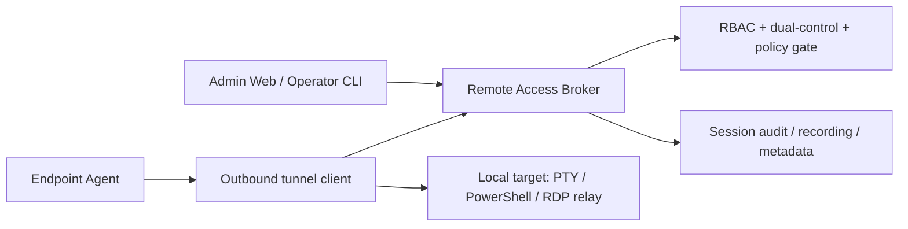

# Faz 22.6 - Remote Access Bridge

> **Status**: PLANNING / BLOCKED by Sensitive Endpoint Ops Governance Gate.
> **Created**: 2026-06-09
> **Board / issue authority**:
> - platform-k8s-gitops [#1388](https://github.com/Halildeu/platform-k8s-gitops/issues/1388) - sensitive endpoint ops governance gate
> - platform-k8s-gitops [#1389](https://github.com/Halildeu/platform-k8s-gitops/issues/1389) - phase boundary sync
> - platform-k8s-gitops [#1400](https://github.com/Halildeu/platform-k8s-gitops/issues/1400) - OSS-only build-vs-buy decision matrix
> - platform-k8s-gitops [#1401](https://github.com/Halildeu/platform-k8s-gitops/issues/1401) - MeshCentral/RustDesk transport adapter POC boundary
> - platform-k8s-gitops [#1402](https://github.com/Halildeu/platform-k8s-gitops/issues/1402) - endpoint-admin broker ADR / state machine
> - platform-backend [#510](https://github.com/Halildeu/platform-backend/issues/510) - remote-access bridge umbrella
> - platform-backend [#524](https://github.com/Halildeu/platform-backend/issues/524) - broker ADR + state machine
> - platform-agent [#116](https://github.com/Halildeu/platform-agent/issues/116) - agent outbound tunnel client spike

Bu doküman, managed endpoint'lere uzaktan destek ve test için **agent-initiated
outbound remote-access bridge** hattını tanımlar. Faz 22.6, Faz 22.5 yazılım
yönetimi komut kuyruğunun yerine geçmez; uzun ömürlü, interaktif ve yüksek
yetkili destek oturumları için ayrı bir güvenlik modeli üretir.

> **Karar kaydı:** Broker mimarisi, OpenFGA `remote_session` authz, token
> kontratı, audit/recording şeması, #1388 minimum pilot seti, KVKK ve threat
> model [`ADR-0033`](./adr/0033-faz-22-6-remote-access-bridge-broker.md)'te
> (3-AI consensus: Codex `019ea9aa` + Mavis/MiniMax `mvs_c922…` + Claude,
> 2026-06-09). Aşağıdaki §4 "Hedef Mimari" üst-seviye kalır; detaylı state
> machine/token/audit ADR-0033'tedir. Owner-decision checklist: §9.

## 1. Amaç

- IT / operator'ın dış ağdaki veya domain'e anlık erişimi olmayan Windows
  endpoint'e güvenli destek oturumu açabilmesi.
- Endpoint tarafında inbound port açmadan, agent'ın dışarı doğru kurduğu
  kontrollü kanal üzerinden erişim sağlanması.
- Geliştirme ve pilot testlerinde uzak cihaz doğrulamasını hızlandırmak, fakat
  bunu üretim güvenlik modelinden koparmamak.

## 2. Faz Sınırı

| Kapsam | Faz | Karar |
|---|---:|---|
| WinGet install/uninstall, catalog, compliance, diagnostics | 22.5 | Mevcut software deployment / managed lifecycle hattı |
| Persistent reverse tunnel, broker, session authorization | 22.6 | Bu dokümanın kapsamı |
| Scheduled backup, offboarding copy, forensic collection | 22.8 | Ayrı Endpoint Data Protection hattı |
| Compliance Gap Mart aggregate reporting | 22.7 | Zaten platform-backend #376 tarafından sahiplenildi |

### 2.1 OSS-only Build-vs-Buy Kararı

> **Canonical karar: [ADR-0036](./adr/0036-faz-22-oss-build-vs-buy.md)** (owner 2026-06-09) — Kategori 1+2 **in-house build**; tunnel = mevcut agent identity/credential kökü reuse + **yeni WS data-plane** (OpenZiti/zrok değil; efor MEDIUM-HIGH staged); PTY = explicit high-risk exception (§4 ADR-0036); Guacamole **yalnız** GUI/RDP gerekirse wrap. Aşağıdaki tablo ADR-0036'nın phase-local özeti.

Faz 22.6 için karar, "remote access ürününü alıp platformun yerine koymak"
değildir. Endpoint-admin **broker / policy / approval / audit** katmanını
kendi üretir; açık kaynak araçlar yalnız transport/relay adayı olabilir.

> Tablo ADR-0036 §2 ile **decision-closed**; aşağıdaki satırlar tarihsel gerekçe + canonical karar etiketidir (actionable transport-seçimi değil).

| Araç / yaklaşım | Karar (ADR-0036) | Gerekçe | Takip |
|---|---|---|---|
| Endpoint-admin broker | **BUILD CORE (Cat-1)** | #1388 dual-control, RBAC, audit/recording, retention, TTL ve abort semantics platform-native olmalı | #1402 |
| 22.6 reverse tunnel | **BUILD IN-HOUSE (Cat-2)** | Yeni WS data-plane mevcut agent identity/credential kökünü (enrollment cert + HMAC) reuse eder; REST-poll transport stream değil; efor MEDIUM-HIGH staged | #1402 |
| MeshCentral | **SKIP-as-core** | Full suite kendi authz/relay'iyle gelir → wrapper ile delmek #1388 governance bypass'ı olur; transport için kendi WS data-plane'imizi kurarız | #1401 |
| RustDesk OSS server/client | **SKIP-as-core** | Aynı gerekçe (full suite + AGPL/paid-pro boundary); transport in-house | #1401 |
| Apache Guacamole | **WRAP-only-if-GUI** | Yalnız screen/RDP/VNC/clipboard/GUI session-shadowing (PTY ötesi) gerektiğinde wrap; PTY pilotu için SKIP | #1400 |
| OpenZiti / zrok | **SKIP** | Mevcut kanal kökleri reuse edilir; ayrı overlay-network transport gereksiz | #1401 |
| Remotely | **SKIP** | Remote scripting/control yüzeyi control plane ile çakışır; GPL + uyum riski | #1400 |

Bu karar runtime yetkisi vermez. #1388 kabul edilmeden relay POC bile yalnız
offline/lab design seviyesinde kalır; canlı remote session açılmaz.

## 3. Non-goals

- Agent command polling hattını gRPC-streaming benzeri tek kanala dönüştürmek.
- Raw shell / arbitrary PowerShell execution'ı Faz 22.5 komut modeli içine
  sızdırmak.
- Dosya yedekleme, kullanıcı klasörü kopyalama veya forensic image alma.
- IT onayı, KVKK/legal basis, RBAC ve audit olmadan unattended erişim açmak.
- VPN yerine domain authentication çözmek. Domain password/cache/pre-logon
  senaryoları ayrı IT/domain runbook'larıyla değerlendirilir.

## 4. Hedef Mimari

Ana prensip: endpoint tarafı **outbound-only** bağlanır. Broker, session
kimliği, TTL, actor, approval, target device ve allowed capability set'i üretir.
Agent yalnız kendisine atanmış kısa ömürlü session token ile bridge açar.

## 5. Milestone Planı

| Milestone | Kapsam | Acceptance |
|---|---|---|
| **22.6.0 Governance gate** | #1388 kararları: legal basis, RBAC, dual-control, audit, retention, redaction | Gate issue kabul edilmeden hiçbir runtime erişim açılmaz |
| **22.6.1 Broker ADR** | Session state machine, authz model, TTL, abort semantics, audit schema | #524 ADR + test fixture + negative authorization cases |
| **22.6.2 Agent tunnel spike** | Outbound-only client, reconnect/backoff, capability advertisement | #116 spike; inbound port yok; disabled-by-default |
| **22.6.3 PTY / command MVP** | Kontrollü support shell veya constrained PTY | Explicit allowlist + full audit + session recording policy |
| **22.6.4 Attended / unattended policy** | User consent prompt, unattended exception policy, break-glass | Owner-approved policy; dual-control enforced |
| **22.6.5 Web/ops surface** | Session request, approve, join, terminate, evidence view | Browser smoke + audit evidence |
| **22.6.6 Pilot** | 2-5 cihaz live pilot | D29: Up + Functional + Secured ayrı kanıtlanır |

## 6. Güvenlik Kapıları

- #1388 sensitive endpoint ops governance gate accepted olmadan runtime yok.
- Session token kısa ömürlü olur; reusable admin credential agent'a verilmez.
- Unattended erişim ayrı policy ister; default attended / explicit approval.
- Same-user self-approval yok; destructive veya sensitive capability dual-control.
- Tüm oturumlarda actor, approver, device, start/end time, capability set,
  command/session metadata ve abort reason auditlenir.
- Session recording / transcript saklama, retention ve erişim politikası KVKK
  ile uyumlu tanımlanır.
- Agent tarafında capability false-advertising guard gerekir: disabled feature
  broker'a açık görünmez.

## 7. D29 Acceptance Model

| Katman | Kanıt |
|---|---|
| **Up** | Broker pod/endpoint reachable; agent tunnel client can connect with disabled-by-default config |
| **Functional** | Authorized session request creates a bounded tunnel; unauthorized request denied; TTL/abort works |
| **Secured** | RBAC + dual-control + audit + retention policy enforce edilir; session token replay/fake-device cases fail closed |

Tek kelimelik "çalışıyor" kabul edilmez. 22.6 runtime claim için bu üç
katman ayrı kanıtlanır.

## 8. Board Mapping

| Issue | Rol | Status yorumu |
|---|---|---|
| gitops #1388 | Sensitive Endpoint Ops Governance Gate | BLOCKED/P0; 22.6 ve 22.8 runtime ön koşulu |
| gitops #1389 | Phase boundary sync | Docs/board truth düzeltme |
| gitops #1400 | OSS-only build-vs-buy decision matrix | **DECISION-CLOSED by ADR-0036** (Cat1+2 in-house); runtime yetkisi vermez |
| gitops #1401 | MeshCentral/RustDesk transport adapter POC boundary | **CLOSED by ADR-0036**: SKIP-as-core, transport in-house WS data-plane; Guacamole wrap-only-if-GUI |
| gitops #1402 | Remote Access Broker ADR / state machine | Todo/P0; broker/policy/audit core kontratı |
| backend #510 | 22.6 umbrella | BLOCKED by #1388 |
| backend #524 | Broker ADR/state machine | BLOCKED by #1388/#510 |
| agent #116 | Agent outbound tunnel spike | BLOCKED by #1388/#524 |

## 9. 3-AI Consensus + #1388 Owner-Decision Checklist (2026-06-09)

3 sağlayıcı (Codex/OpenAI `019ea9aa` + Mavis/MiniMax `mvs_c922…` + Claude/Anthropic) bağımsız mutabakat: build-vs-buy **hybrid**, `pilot_ready_after_owner_decision: **no**`. Tam karar kaydı [ADR-0033](./adr/0033-faz-22-6-remote-access-bridge-broker.md).

### 9.1 Agent-actionable ŞİMDİ (runtime açmadan — paralel ilerler)

- [x] ADR-0033 broker mimarisi + authz + token + audit + threat model + KVKK (bu PR)
- [ ] `#1402`/`#524` broker skeleton: state-machine + OpenFGA `remote_session` + token contract + audit schema, **`ENABLE_REMOTE_SUPPORT=false`** disabled-by-default, tests only
- [x] OSS matris refinement (#1400/#1401): **CLOSED by ADR-0036** — transport in-house (OpenZiti/zrok/MeshCentral/RustDesk SKIP), Guacamole wrap-only-if-GUI; per-tool bypass-risk kaydı ADR-0036 §2
- [ ] Negative-test plan: self-approval deny · expired/replayed token deny · capability-mismatch deny · recorder-unavailable deny (fail-closed)
- [ ] Synthetic loopback tunnel spike (#116) — **lab/synthetic only**; managed endpoint'e bağlanmak runtime sayılır

### 9.2 Owner / legal decision checklist (#1388 — runtime'ı açan kapı, sensiz ilerleyemez)

> Formal imza kaydı: **[ADR-0034](./adr/0034-1388-sensitive-endpoint-ops-owner-decision.md)** (#1388 Owner Decision Record, ADR-0030 stili — D1 legal basis … D10 acceptance gate + Veri Sorumlusu/Hukuk/İK/IT-Security imza bloğu). Aşağıdaki liste o ADR'nin operasyonel özeti.

Aşağıdakiler kabul edilip #1388'de imzalanmadan **hiçbir canlı session açılmaz**:

- [ ] **Legal basis (KVKK)**: meşru menfaat / sözleşme / hukuki yükümlülük + aydınlatma metni; employee consent tek başına yetersiz (güç asimetrisi). İK + Hukuk imzalı policy + employee acknowledgment.
- [ ] **KVKK kapsam**: m.5 işleme şartı (legal basis) + m.10 aydınlatma + m.12 veri güvenliği — session recording = kişisel veri işleme kabulü; m.6 yalnız özel-nitelikli veri varsa, m.9 yalnız sınır-ötesi aktarım varsa; ADR-0030 encryption + RBAC + access-audit reuse.
- [ ] **Recording retention/access**: metadata 7y / raw 30-90g encrypted / sadece IT-Security-lead + Data-Controller + incident-responder; segment-erişim audit'i.
- [ ] **Attended/unattended + break-glass policy**: pilot **attended-only**; unattended/break-glass Phase 2 (ayrı ADR) → **[ADR-0040](./adr/0040-faz-22-6-breakglass-domain-auth-recovery.md)** drafted (PROPOSED, owner-sign-off pending §9): agent-mediated Kerberos AS-REQ relay for offline domain-auth recovery; a **separate capability plane** from the attended VIEW_ONLY pilot (D8 untouched). Realizes the anticipated Phase-2 break-glass ADR.
- [ ] **Named pilot scope**: 2-5 IT-owned cihaz + named requester/operator/approver listesi.
- [ ] **Capability sınıfları**: pilot için izinli set (öneri: view-only veya allowlist'li PTY; file-transfer/clipboard/elevation OFF).
- [ ] **3rd-party OSS/relay DPA**: ADR-0036 ile transport in-house olduğundan standing relay-subprocessor yok; DPA yalnız bir Cat-3 wrap (örn. Guacamole GUI-shadowing) gerçekten devreye alınırsa gerekir (o noktada ayrı ADR + DPA review).

### 9.3 Pipeline

`#1388 owner/legal accept` → `ADR-0033 ACCEPTED` → OSS seçimi → broker impl + negative-test evidence → recording fail-closed evidence → **ilk attended pilot (D29-EA Up/Functional/Secured ayrı kanıt)**.

### 9.4 End-to-end secure build roadmap (Codex red-team absorb `019eb54b`, 2026-06-11)

Owner directive (2026-06-11): complete 22.6 end-to-end to industry-standard (PAM/zero-trust), step by step, absorbing the independent cross-AI security audit. Phases (issue #1445 tracks Faz A; B–E under #510 epic):

- **Faz A — governance + control-plane hardening (agent-doable):** A1 absorb 6 red-team findings → ADR-0033 §9b + ADR-0034 §11/D10 expanded gate *(this PR)*; A2 skeleton hardening — uniform-`DENIED`/constant-time validator + `reevaluateActive()` continuous-re-eval policy hook + tests.
- **Faz B — crypto/identity foundation:** mTLS + non-exportable (TPM/HSM) cert-bound token + PKI (CRL/OCSP/rotation); atomic distributed jti store + rate-limit; agent attestation (SBOM/SLSA/reproducible/binary-hash).
- **Faz C — session integrity:** continuous-re-eval runtime + real-time kill-switch/global deny-list; WORM encrypted hash-chained recording + fail-closed writer; **out-of-band signed append-only audit sink** + clock integrity.
- **Faz D — channel + endpoint:** outbound-only tunnel (self-hosted, D9) + broker separate deployment + NetworkPolicy/egress; operator-channel (FIDO2/CSRF/nonce/re-auth); **VIEW_ONLY exfil controls** (DLP/masking/watermark/visible-indicator/local-abort + coercion UX).
- **Faz E — acceptance:** negative-test LIVE evidence + red-team drill report + D29-EA → first 2–5 device attended pilot (owner go).

Each phase is disabled-by-default until E; no live session before the §11/D10 expanded gate.

### 9.5 Data-plane phasing + agent-completable status (2026-06-15, agent-side T-4 BUILT + VM-gold-proven)

The bridge wire (`remote_bridge.proto`) is **FROZEN + backend-owned** (shadow wire spec `endpoint-admin-service/docs/remote-bridge-wire-contract.md`); the agent copy is **vendored (T-3)** — wire changes originate backend-side + re-vendor, never agent-side. The `Data` stream + `DataFrame`/`ErrorFrame` are declared (T-2a); the **live stream is not yet opened** — the agent-side capture/stream/exfil engine now EXISTS (built + VM-gold-proven, disabled-by-default under the §13 build-only path) but is unwired to the live `Data` stream until the broker-side T-2b lands. Phasing:

| Phase | Scope | Status |
|---|---|---|
| T-1 / T-2a / T-3 | domain records · wire contract+codegen+adapters · vendored agent proto | ✅ done |
| **Control-plane runtime** | agent harness: dial/AgentHello/heartbeat-watchdog/**KILL-priority** (KILL on CONTROL, structurally never delayed by DATA — agent never opens DATA)/seqGuard/backoff; `data_frame`-while-idle → **fail-closed defect-close** + `ErrorFrame("unsupported-payload-in-idle")` + counter (observable, not silent) | ✅ done + tested (15 harness tests) |
| Authority/approval (B1/C/D control-side) | cert-bound token · token-lifecycle · dual-control approval→grant→PERMIT · operator-JWT-auth · duress | ✅ done (see [[project-faz-22-6-t4-bridge-wiring]]) |
| **T-4 agent-side VIEW_ONLY data-plane** (capture + secure-stream + exfil + endpoint-awareness) | GDI screen capture · PNG codec · session-launcher (SYSTEM→session-1, no password) · secured named-pipe (protected DACL + nonce) · frame-IPC · in-frame exfil controls (active-indicator/screen-mask) + producer pipeline-wiring · endpoint-awareness banner | ✅ **BUILT + VM-gold-proven (disabled-by-default, §13 build-only)** — 15 PRs #172–#182, Codex `019ecbc5` AGREE each slice; real-Windows proofs: real-pixel capture, streaming+exfil (band survives e2e), banner (96/96 top-center red on real desktop) |
| **T-2b DATA-stream wiring + broker-side** | opening the live `Data` gRPC stream (dataplane producer → bridge Data stream → broker consume) + broker backpressure/recording | ⏳ **broker-side = NEXT agent-completable track** (platform-backend / endpoint-admin-service, against the frozen wire; control-plane openSession + resolver already exist, slice-4c) — **agent producer is ready** |
| **T-4 LIVE activation** + Faz D policy-mask-source / recording-WORM / telemetry / production default-on wiring | turning the built data-plane ON in a real session | 🔒 **owner-pilot-gated (ADR-0034 §13/D10)** |
| Faz E LIVE acceptance | negative-test LIVE + red-team + D29-EA → attended pilot | 🔒 **owner-go** |

**Agent-side 22.6 VIEW_ONLY data-plane = BUILT + VM-gold-proven** (capture + secure-stream + in-frame exfil controls + pipeline wiring + stream-exfil proof + endpoint-awareness banner; 15 PRs #172–#182, disabled-by-default, Codex `019ecbc5` AGREE each slice). This **supersedes** the earlier "building agent data-plane code = speculative" stance: ADR-0034 **§13 explicitly permits disabled-by-default BUILD**; only LIVE activation needs D10, so the §13 build-only path was the correct, non-speculative track (each slice cross-AI-reviewed + real-Windows gold-proven).

**Remaining agent-completable:** broker-side **T-2b** DATA-stream runtime (platform-backend / endpoint-admin-service, against the frozen wire — control-plane openSession already exists; needs its own plan-time design) · agent-side residuals (PID-verify hardening [winio-blocked raw-handle, Codex-deferred as defense-in-depth-not-primary], banner multi-monitor).

**Remaining owner/operator-gated:** policy/DLP mask source · recording WORM writer · telemetry counters · production default-on wiring · T-4 LIVE activation · Faz E attended pilot + physical PCs · ADR-0040 §9 sign-off · #1388 §9.2 owner decisions [signed 2026-06-11].

Phase-limited claim: NOT "all of 22.6 done" — the **live bridge end-to-end** still needs the broker-side T-2b + the owner LIVE gate. Board canonical: **#1580** (In Progress).
