# Semantik Mimari

> **Interpretation gate:** Once [../AGENTS.md](../AGENTS.md), ardindan [context-priority-rules.md](./context-priority-rules.md) okunur.
> **Role:** Bu dokuman canli truth snapshot'i degil; repo siniri, topoloji ve `test -> prod` promotion semantigini anlatan canonical mimari ozettir.

Bu dokuman, `platform-k8s-gitops` reposunun yonettigi hedef topolojiyi ve repo sinirlarini tek yerde toplar.

## Ozet

- Tasinan sistem: `autonomous-orchestrator` platformunun Kubernetes dagitim ve operasyon katmani
- Uygulama kaynak kodu ve artifact uretimi: `platform-ssot`
- GitOps repo gorevi: manifest, overlay, ArgoCD application, host-level stateful compose ve operasyonel kontrat

## Semantik Katmanlar

1. Edge katmani
   `ai.acik.com` ve `testai.acik.com` host seviyesinde karsilanir, TLS burada sonlanir.
2. Ingress katmani
   Host edge proxy, istegi `k3d-prod` veya `k3d-test` icindeki ingress-nginx'e yollar.
3. Uygulama katmani
   `frontend`, `api-gateway`, `auth-service`, `user-service`, `variant-service`, `core-data-service`, `report-service`, `schema-service`
4. Yetkilendirme katmani
   `openfga` Zanzibar tarzli authz motorudur.
5. Stateful katman
   `postgres`, `keycloak`, `vault` prod ve test icin host seviyesinde ayri instance olarak yasar.
6. Kontrol ve gozlem katmani
   ArgoCD, Prometheus, Grafana, Loki, Tempo
7. Artifact ve deploy katmani
   Uygulama image'lari ana repoda build edilir, GHCR'a push edilir, bu repo tarafindan deploy edilir.
8. Promotion katmani
   Test ortami sadece paralel bir kopya degil, prod'a gecisin kabul kapisidir. D29 seviyeleri, soak ve blocker kapilari temizlenmeden prod sync ve cutover baslamaz.

## Repo Siniri

Bu repoya ait olanlar:

- `kustomize/base`
- `kustomize/overlays`
- `argocd/applications`
- `host-compose`
- `helm-values`
- bootstrap ve operasyon scriptleri

Bu repoya ait olmayanlar:

- Java servis kaynak kodu
- Dockerfile build mantigi
- `application-k8s.yml`
- backend CI build mantigi

## Testten Proda Akis

Bu akis runtime trafik akisi degil, release promotion semantigidir:

1. Uygulama image'i ana repoda build edilir ve GHCR'a push edilir.
2. Bu repo once test overlay uzerinden `k3d-test` ortamini besler.
3. `testai.acik.com` uzerinde `Up`, `Functional`, `Zanzibar-ready` ve soak kaniti toplanir.
4. Test Stability Gate temizlenmeden ve aktif blocker'lar kapanmadan prod promotion baslamaz.
5. Go/No-Go gate asamasinda artifact sabitlenir ve prod onayi verilir.
6. ArgoCD prod overlay'i sync eder.
7. Cutover ile `ai.acik.com` authoritative olarak prod cluster'a gecirilir.

## Diyagram

```mermaid
flowchart TB
    U["Kullanici ve Kurum Agi"]
    DNS["DNS ve Hostname Katmani\nai.acik.com / testai.acik.com"]
    EDGE["Host Edge Proxy\nnginx TLS termination + SNI routing"]

    subgraph HOST["staging-sw Tek Host"]
        subgraph PROD_CLUSTER["k3d-prod"]
            PROD_ING["ingress-nginx"]
            PROD_ARGO["ArgoCD"]
            PROD_MON["Monitoring\nPrometheus + Grafana + Loki + Tempo"]
            subgraph PROD_NS["platform-prod"]
                PROD_FE["frontend\nMFE shell"]
                PROD_GW["api-gateway"]
                PROD_AUTH["auth-service"]
                PROD_USER["user-service"]
                PROD_VAR["variant-service"]
                PROD_CORE["core-data-service"]
                PROD_REP["report-service"]
                PROD_SCHEMA["schema-service"]
                PROD_FGA["openfga"]
            end
        end

        subgraph TEST_CLUSTER["k3d-test"]
            TEST_ING["ingress-nginx"]
            TEST_MON["Minimal Monitoring"]
            subgraph TEST_NS["platform-test"]
                TEST_FE["frontend"]
                TEST_GW["api-gateway"]
                TEST_AUTH["auth-service"]
                TEST_USER["user-service"]
                TEST_VAR["variant-service"]
                TEST_CORE["core-data-service"]
                TEST_REP["report-service"]
                TEST_SCHEMA["schema-service"]
                TEST_FGA["openfga"]
            end
        end

        subgraph STATEFUL["Host-level Stateful Layer"]
            PG_PROD["postgres-prod"]
            KC_PROD["keycloak-prod"]
            VAULT_PROD["vault-prod"]
            PG_TEST["postgres-test"]
            KC_TEST["keycloak-test"]
            VAULT_TEST["vault-test"]
        end
    end

    subgraph GITOPS["GitOps ve Build Akisi"]
        GITOPS_REPO["platform-k8s-gitops\nmanifest + overlays + ArgoCD apps"]
        APP_REPO["platform-ssot\nuygulama kaynak kodu + Dockerfile + application-k8s.yml"]
        GHCR["GHCR\nimmutable image artifact"]
    end

    subgraph PROMOTION["Testten Proda Promotion Akisi"]
        TEST_GATE["Test Stability Gate\nD29 smoke + Zanzibar + soak"]
        RELEASE_GATE["Go/No-Go Gate\nartifact sabitleme + prod onayi"]
        CUTOVER["Cutover\nai.acik.com -> prod"]
    end

    U --> DNS --> EDGE
    EDGE -->|"ai.acik.com"| PROD_ING
    EDGE -->|"testai.acik.com"| TEST_ING

    PROD_ING --> PROD_FE
    PROD_ING --> PROD_GW
    TEST_ING --> TEST_FE
    TEST_ING --> TEST_GW

    PROD_GW --> PROD_AUTH
    PROD_GW --> PROD_USER
    PROD_GW --> PROD_VAR
    PROD_GW --> PROD_CORE
    PROD_GW --> PROD_REP
    PROD_GW --> PROD_SCHEMA
    PROD_AUTH --> PROD_FGA

    TEST_GW --> TEST_AUTH
    TEST_GW --> TEST_USER
    TEST_GW --> TEST_VAR
    TEST_GW --> TEST_CORE
    TEST_GW --> TEST_REP
    TEST_GW --> TEST_SCHEMA
    TEST_AUTH --> TEST_FGA

    PROD_AUTH -.-> KC_PROD
    PROD_USER -.-> PG_PROD
    PROD_VAR -.-> PG_PROD
    PROD_CORE -.-> PG_PROD
    PROD_REP -.-> PG_PROD
    PROD_SCHEMA -.-> PG_PROD
    PROD_FGA -.-> PG_PROD
    PROD_ARGO -.-> VAULT_PROD

    TEST_AUTH -.-> KC_TEST
    TEST_USER -.-> PG_TEST
    TEST_VAR -.-> PG_TEST
    TEST_CORE -.-> PG_TEST
    TEST_REP -.-> PG_TEST
    TEST_SCHEMA -.-> PG_TEST
    TEST_FGA -.-> PG_TEST

    APP_REPO --> GHCR
    GHCR --> GITOPS_REPO
    GITOPS_REPO --> PROD_ARGO
    GITOPS_REPO --> TEST_CLUSTER
    TEST_CLUSTER -.->|"D29 kaniti uretir"| TEST_GATE
    TEST_MON -.->|"alert ve probe"| TEST_GATE
    GHCR -.->|"immutable image"| RELEASE_GATE
    TEST_GATE -.->|"gate temiz ise"| RELEASE_GATE
    RELEASE_GATE -.->|"prod overlay sync"| PROD_ARGO
    RELEASE_GATE -.->|"freeze window"| CUTOVER
    CUTOVER -.->|"authoritative trafik"| EDGE
```

## Kullanım

- Markdown olarak okumak icin: `docs/semantic-architecture.md`
- Mermaid kaynak olarak kullanmak icin: `docs/semantic-architecture.mmd`
- SVG render gerekiyorsa `mmdc` veya benzeri bir Mermaid renderer ile bu dosya uzerinden uretilebilir.
